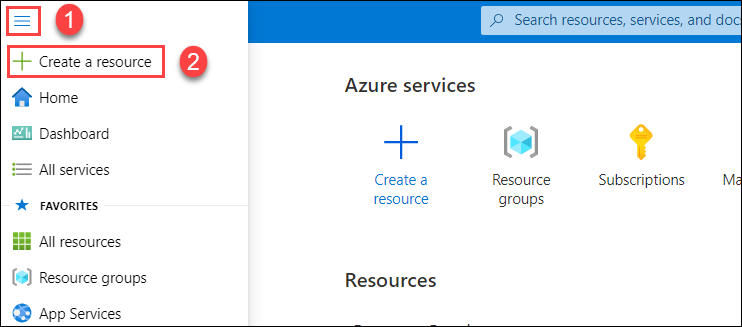
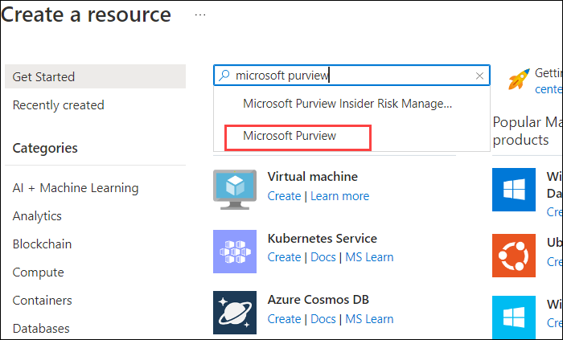
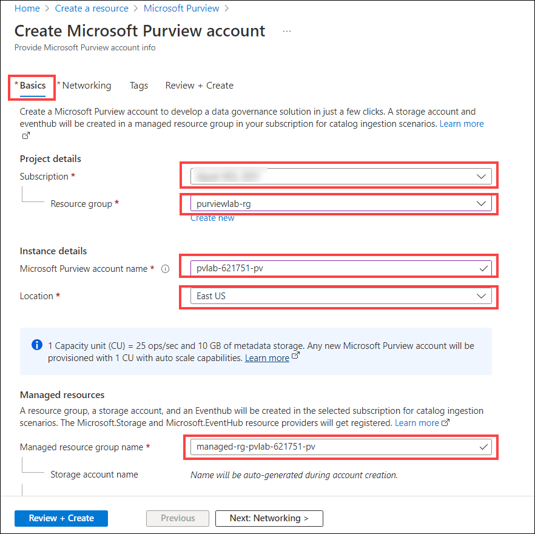
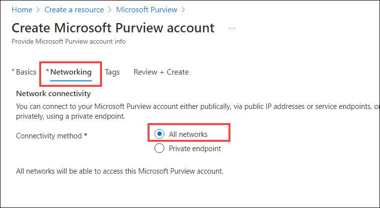
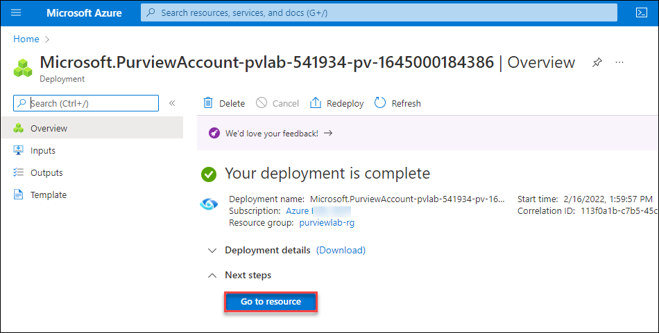
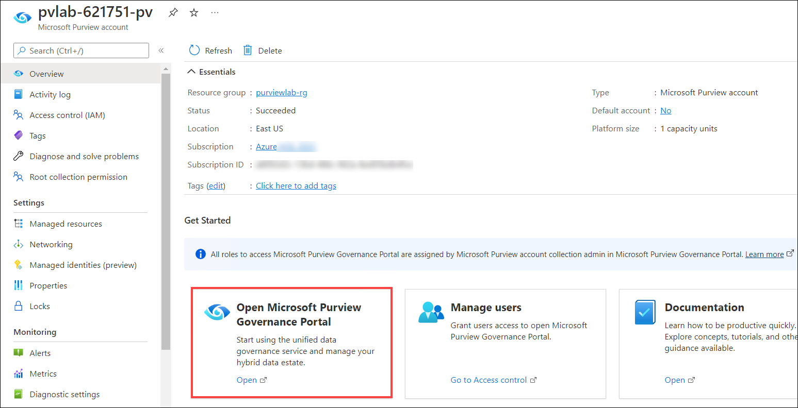
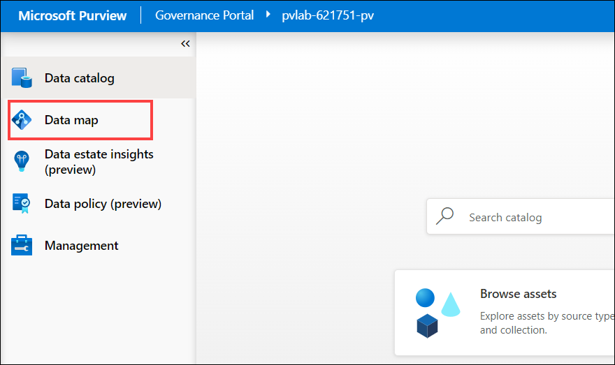
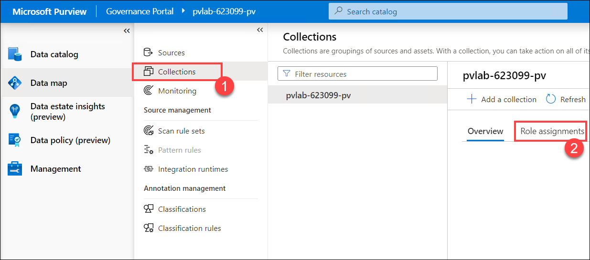
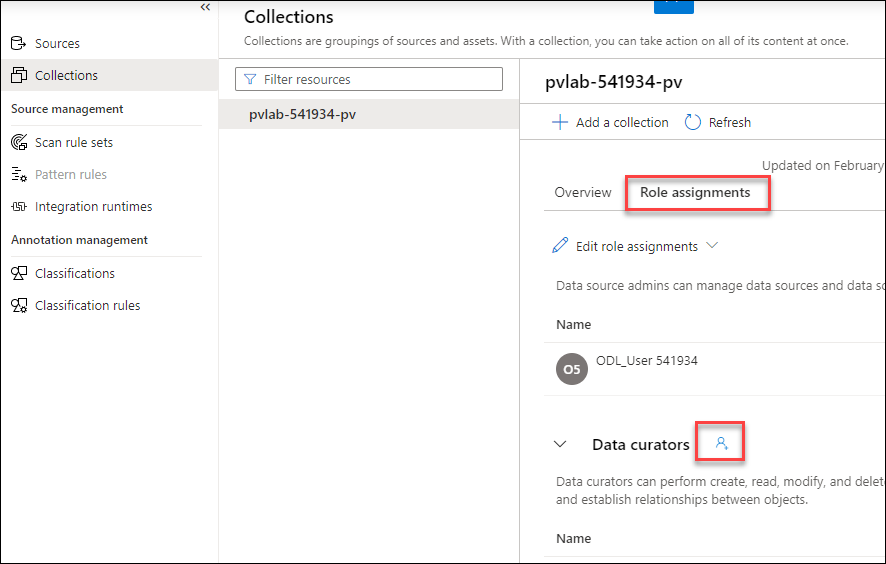
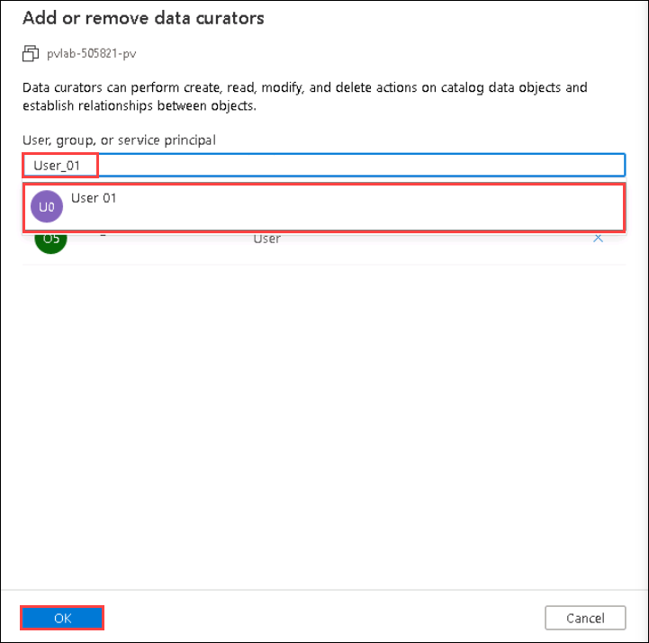

# Module 01 - Create an Microsoft Purview Account

## Introduction

Microsoft Purview is a unified data governance solution that helps you manage and govern your data at large. It combines many different services for scanning, collecting, organizing and sharing metadata. It uses a catalogue for discoverability, but also offers other features, such as automatic classification, sharing, access management and so on.

When planning your Microsoft Purview deployment, you first need to provision a Microsoft Purview account. Next, you need to define your collections for managing and grouping data assets together. A collection is a logical container in which your metadata, such as data sources, will be managed. When creating collections and placing them in a hierarchy, you need to make different considerations, such as your security requirements, governance structure and democratization needs. For example, a more centralized-alined style of data management leads to different collection structure then a more domain-oriented style of data management. Depending on your needs, different topologies can be used for managing your data. Best practices for this can be found on [this website](https://docs.microsoft.com/azure/purview/concept-best-practices-collections).

## Objectives

* Create an Microsoft Purview account using the Azure portal.
* Provide additional users access to Microsoft Purview's data plane.

## Table of Contents

| #  | Section | Role |
| --- | --- | --- |
| 1 | [Create an Microsoft Purview Account](#1-create-an-azure-purview-account) | Azure Administrator |
| 2 | [Grant Access to Microsoft Purview's Data Plane](#2-grant-access-to-azure-purviews-data-plane) | Collection Administrator |

## 1. Create an Microsoft Purview Account

1. In the Azure portal, expand the portal's left navigation and select **+ Create a resource**, search for **Microsoft Purview** and select it.
    

    

2. On the **Microsoft Purview** blade, select **Create**.

    

3. Provide the below inputs on the **Basics** tab.  

    > Note: Replace the **{randomId}** with the **Deployment Id** from the Environemnt Details Page.

    | Parameter  | Example Value |
    | --- | --- |
    | Subscription | `YOUR_AZURE_SUBSCRIPTION` |
    | Resource group | `purviewlab-rg` |
    | Purview account name | `pvlab-**<inject key="Deployment ID" enableCopy="true"/>**-pv` |
    | Location | `Choose the same region as the Resource Group` |
    | Managed Resource Group Name | `managed-rg-pvlab` |

    

    > :bulb: **Did you know?**
    >
    > **Capacity Units** determine the size of the platform and is a **provisioned** (always on) set of resources that is needed to keep the Microsoft Purview platform up and running. 1 Capacity Unit is able to support approximately 25 data map operations per second and includes up to 2GB of metadata storage about data assets.
    >
    > Capacity Units are required regardless of whether you plan to invoke the Microsoft Purview API endpoints directly (i.e. ISV scenario) or indirectly via Purview Studio (GUI).
    >
    > Note: With the introduction of the [Elastic Data Map](https://docs.microsoft.com/en-us/azure/purview/concept-elastic-data-map), you no longer need to specify how many Capacity Units that you need. Microsoft Purview will scale capacity elastically based on the request load.
    > 
    > **vCore Hours** on the other hand, is the unit of measure for **serverless** compute that is needed to run a scan. You only pay per vCore Hour of scanning that you consume (rounded up to the nearest minute).
    >
    > For more information, check out the [Microsoft Purview Pricing](https://azure.microsoft.com/en-us/pricing/details/azure-purview/) page.

4. On the **Networking** tab, select **All networks**.
   
    

5. On the **Review + Create** tab, once the message in the ribbon returns "Validation passed", verify your selections and click **Create**.

    

6. Wait several minutes while your deployment is in progress. Once complete, click **Go to resource**.

    

## 2. Grant Access to Microsoft Purview's Data Plane

1. Navigate to your Microsoft Purview account and click **Open** within the **Open Purview Studio** tile.

    

2. On the left-hand side, navigate to **Data map**.

    

3. Select **Collections (1)** and click on **Role assignments (2)**.

    

4. On the **Role assignments (2)** blade, scroll down and click on the **Add** icon that is next to **Data curators**.

    

5. Search for the user **user 01** within your Azure Active Directory, select their account, click OK.

    

    > :bulb: **Did you know?**
    >
    > Microsoft Purview has a set of predefined data plane roles that can be used to control who can access what.
    >
    > For more information, check out [Access control in Microsoft Purview](https://docs.microsoft.com/en-us/azure/purview/catalog-permissions).

    | Role  | Collections | Catalog | Sources/Scans | Description | 
    | --- | --- | --- | --- | --- |
    | Collection Admin | `Read/Write` | | | Manage collections and role assignments. |
    | Data Reader ||  `Read` |  | Access to catalog (read only). |
    | Data Curator || `Read/Write` |  | Access to catalog (read & write). |
    | Data Source Admin |  || `Read/Write` | Manage data sources and data scans. |

## Knowledge Check

[http://aka.ms/purviewlab/q01](http://aka.ms/purviewlab/q01)

1. Which of the following Microsoft Purview pricing meters is fluid, with consumption varying based on usage?

    A ) Capacity Units  
    B ) vCore Hours  
    C ) Neither

2. Which of the following Microsoft Purview pricing meters is always on, with consumption based on quantity provisioned?

    A ) Capacity Units  
    B ) vCore Hours  
    C ) Neither

3. Which Microsoft Purview module provides the base functionality (i.e. source registration, automated scanning and classification, data discovery)?

    A ) C0  
    B ) C1  
    C ) D0

4. Which predefined Microsoft Purview role provides access to manage data sources?

    A ) Purview Data Reader  
    B ) Purview Data Curator  
    C ) Purview Data Source Administrator

## Summary

This module provided an overview of how to provision an Microsoft Purview account using the Azure Portal and how to grant the appropriate level of access to Microsoft Purview's data plane.
