# Module 02A - Register & Scan (ADLS Gen2)

## :loudspeaker: Introduction

To populate Microsoft Purview with assets for data discovery and understanding, you must register sources that exist across our data estate so that we can leverage the out of the box scanning capabilities. Scanning enables Microsoft Purview to extract technical metadata such as the fully qualified name, schema, data types, and apply classifications by parsing a sample of the underlying data.

In this module, you'll walk through how to register and scan data sources. You'll create a new collection for your first data source, upload data and configure scanning. By the end of this module you'll have technical metadata, such as schema information, stored in Purview. You can use this to start linking to business terms, allowing your team members to easier find data

## :dart: Objectives

* Create a collection.
* Register and scan an Azure Data Lake Storage Gen2 account using the Microsoft Purview managed identity.


## :bookmark_tabs: Table of Contents

| #  | Section | Role |
| --- | --- | --- |
| 1 | [Grant the Microsoft Purview Managed Identity Access](#1-grant-the-azure-purview-managed-identity-access) | Azure Administrator |
| 2 | [Upload Data to Azure Data Lake Storage Gen2 Account](#2-upload-data-to-azure-data-lake-storage-gen2-account) | Azure Administrator |
| 3 | [Create a Collection](#3-create-a-collection) | Collection Administrator |
| 4 | [Register a Source (ADLS Gen2)](#4-register-a-source-adls-gen2) | Data Source Administrator |
| 5 | [Scan a Source with the Microsoft Purview Managed Identity](#5-scan-a-source-with-the-azure-purview-managed-identity) | Data Source Administrator |
| 6 | [View Assets](#6-view-assets) | Data Reader |

## 1. Grant the Microsoft Purview Managed Identity Access

> :bulb: **Did you know?**
>
> To scan a source, Microsoft Purview requires a set of **credentials**. For Azure Data Lake Storage Gen2, Microsoft Purview supports the following [authentication methods](https://docs.microsoft.com/en-gb/azure/purview/register-scan-adls-gen2#setting-up-authentication-for-a-scan).
>
> * Managed Identity (recommended)
>* Service Principal
> * Account Key
> 
> In this module we will walk through how to grant the Microsoft Purview Managed Identity the necessary access to successfully configure and run a scan.

1. Navigate to the **purviewlab-rg** resource group, and then go to `pvlab{randomId}adls` storage account.

    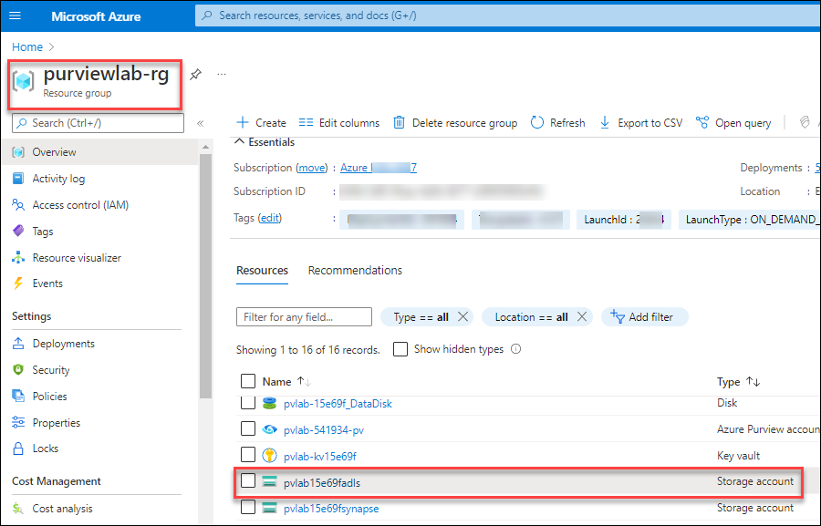

2. Select **Access Control (IAM) (1)** from the left navigation menu and click **Add role assignments (2)**.

    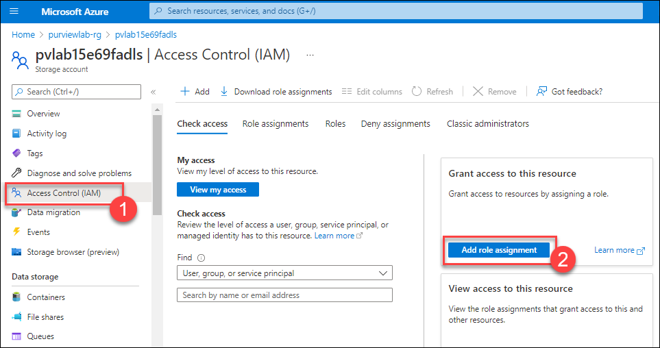

3. Filter the list of roles by searching for **Storage Blob Data Reader (1)**, click the row to select the role, and then click **Next (2)**.

    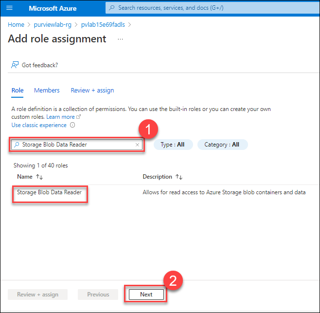

4. Under **Assign access to**, select **Managed identity (1)** and click **+ Select members (2)**. 

    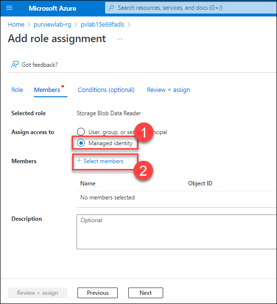
    
5. select **Purview account (1)** from the **Managed Identity** drop-down menu, select the managed identity **pvlab-<inject key="Deployment ID" enableCopy="false" />-pv(2)**, click **Select (3)**. Finally, click **Review + assign**.
   
    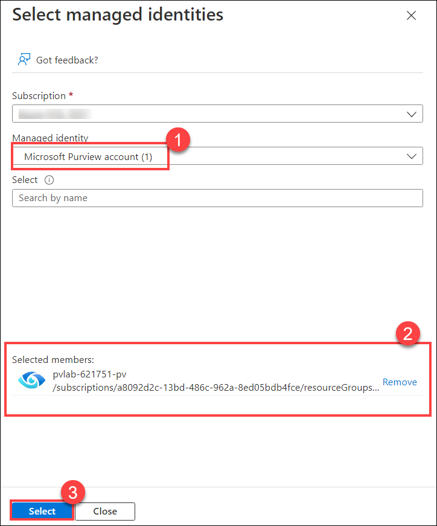

6. Click **Review + assign** once more to perform the role assignment.

    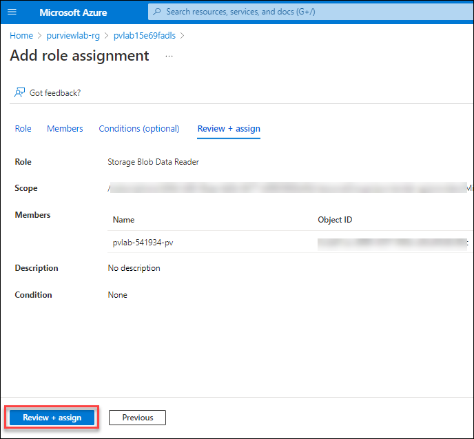

7. To confirm the role has been assigned, navigate to the **Role assignments (1)** tab and filter the **Scope (2)** to `This resource`. You should be able to see that the Microsoft Purview managed identity has been granted the **Storage Blob Data Reader (3)** role.

    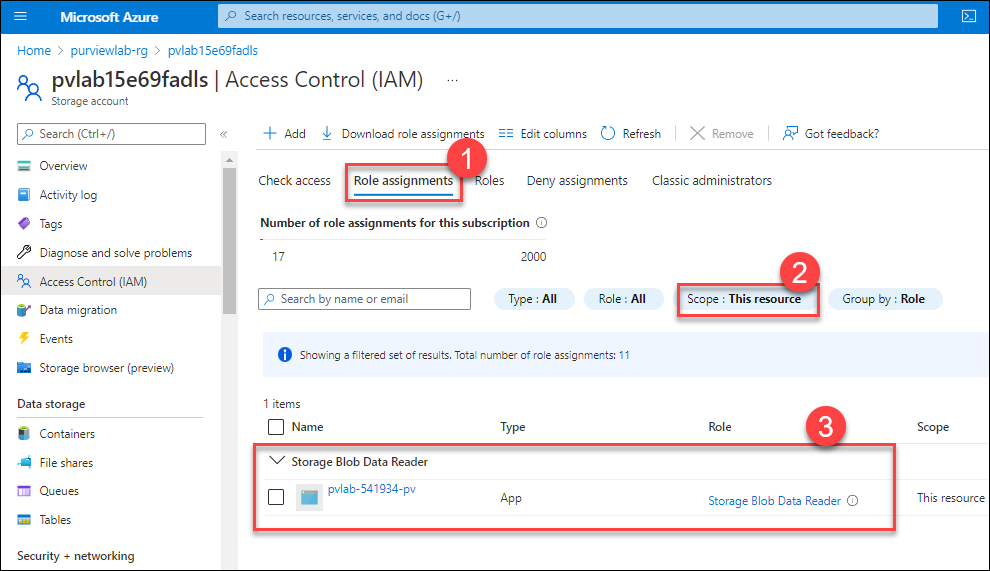

## 2. Upload Data to Azure Data Lake Storage Gen2 Account

1. Download a copy of the **[Bing Coronavirus Query Set](https://github.com/tayganr/purviewlab/raw/main/assets/BingCoronavirusQuerySet.zip)** to your local machine. Note: This data set was originally sourced from [Microsoft Research Open Data](https://msropendata.com/datasets/c5031874-835c-48ed-8b6d-31de2dad0654).

2. Locate the downloaded zip file via File Explorer and unzip the contents by right-clicking the file and selecting **Extract All...**.

    

3. Click **Extract**.

    
    
4. Go to the **desktop** and Open the **Azure Storage Explorer** application.

   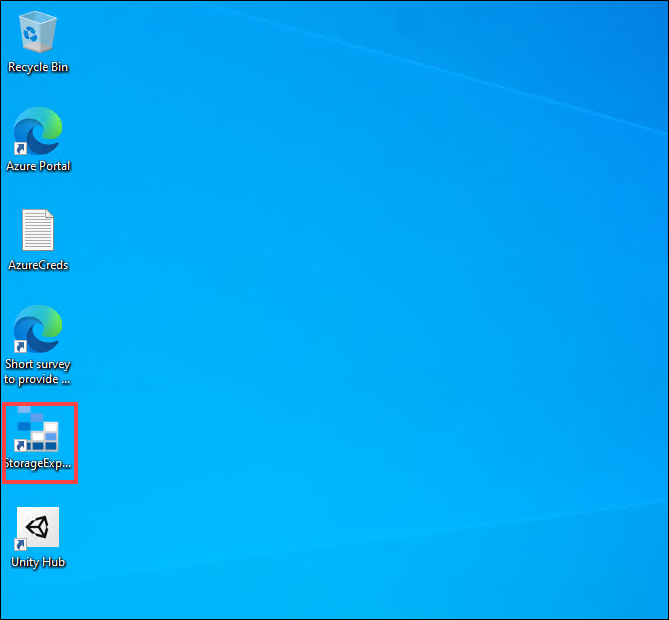
   
5. Select **Account Managment** and click on **Add an account** to add the account. 

   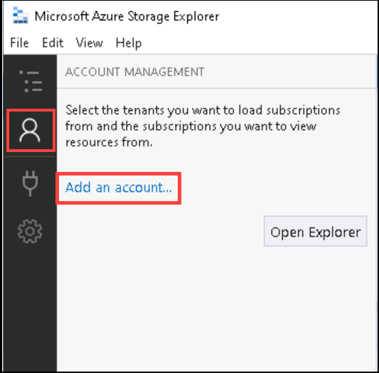
 
6. On the **Select Resource** blade, select **Subcription**.

7. On the **select Azure Environment** page, select **Azure** and click on **Next**. Sign in using the below credentials.

      * Email/Username: <inject key="AzureAdUserEmail"></inject>
      * Password: <inject key="AzureAdUserPassword"></inject>

   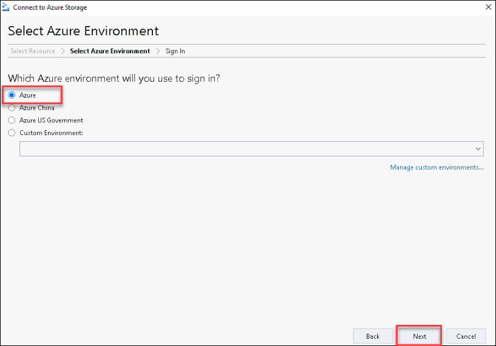 

    > You can also find the credentials from the **Environment Details** page
    
7. Open Azure Storage Explorer, click on the Toggle Explorer icon, expand the Azure Subscription and then `pvlab{randomId}adls` Azure Storage Account. Right-click on Blob Containers and select **Create Blob Container**. Name the container **raw**.

    

8. With the **raw** container selected, click on the **Upload** button and select **Upload Folder...**.

    

9. Click on the **ellipsis** to select a folder.

    

10. Navigate to the extracted **BingCoronavirusQuerySet** folder (e.g. Downloads\BingCoronavirusQuerySet) and click **Select Folder**.

    

11. Click **Upload**.

    

12. Monitor the **Activities** until the transfer is complete.

    

## 3. Create a Collection

>:bulb: **Did you know?**
>
> [Collections](https://docs.microsoft.com/en-us/azure/purview/how-to-create-and-manage-collections) in Microsoft Purview can be used to organize data sources, scans, and assets in a hierarchical model based on how your organization plans to use Microsoft Purview. The collection hierarchy also forms the security boundary for your metadata to ensure users don't have access to data they don't need (e.g. sensitive metadata). 
>
> For more information, check out [Collection Architectures and Best Practices](https://docs.microsoft.com/en-us/azure/purview/concept-best-practices-collections).

1. Navigate back to the browser tab in which Purview Studio is open. From the Purview Studio, navigate to **Data Map** > **Collections**, and click  **Add a collection**.

    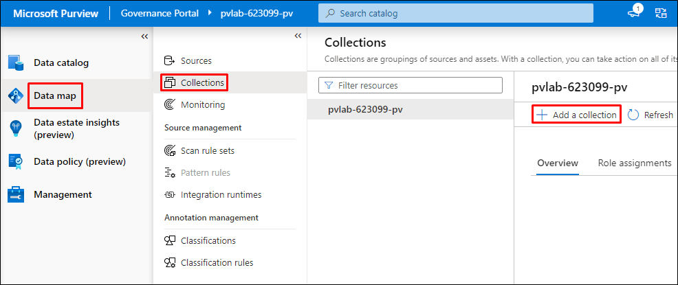

2. Provide the below value for the collection name and click on **Create**.

   ```
   Contoso
   ```

    

## 4. Register a Source (ADLS Gen2)

1. From the Purview Studio, navigate to **Data Map** > **Sources**, and click on **Register**.

    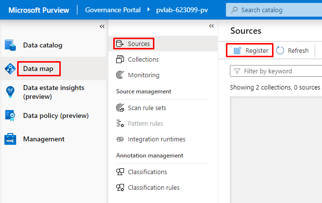

2. On the **Register Sources** blade, scroll down and select **Azure Data Lake Storage Gen2** and click **Continue**.

    

3. Now, on the **Register sources (Azure Data Lake Storage Gen2)** blade, enter the following information:
    - **Azure subscription**: Select your subscription from the dropdown.
    - **Storage account name**: Select **pvlab{randomId}adls** from the dropdown.
    - **Select a collection**: Select **pvlab-randomId}-pv > Contoso** from the dropdown.
    -  Leave other values as default and click on **Register**.

    > :bulb: **Did you know?**
    >
    > At this point, we have simply registered a data source. Assets are not written to the catalog until after a scan has finished running.

    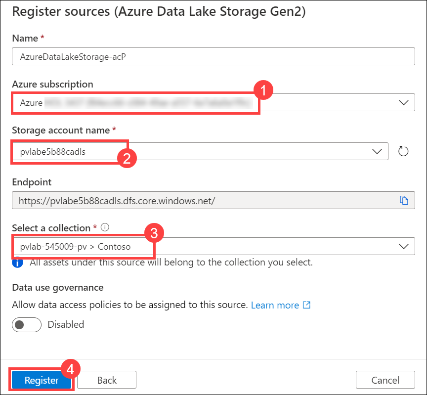

## 5. Scan a Source with the Microsoft Purview Managed Identity

1. From the Purview Studio, navigate to **Data Map** > **Sources**, and within the Azure Data Lake Storage Gen2 tile, click the **New Scan** button.

    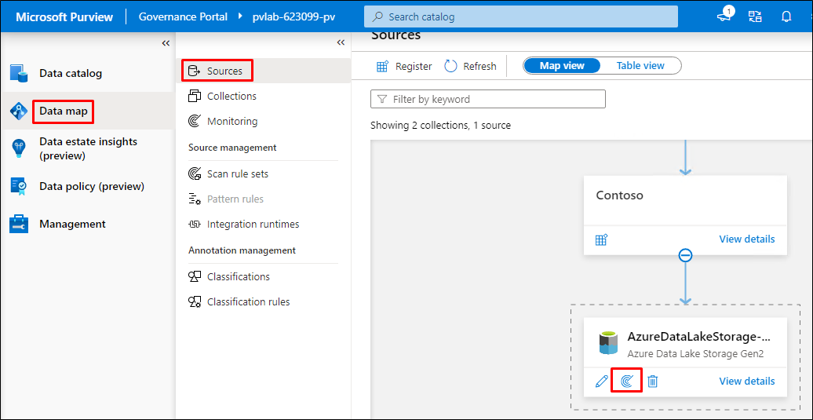

2. Click **Test connection** to ensure the Microsoft Purview managed identity has the appropriate level of access to read the Azure Data Lake Storage Gen2 account. If successful, click **Continue**.

    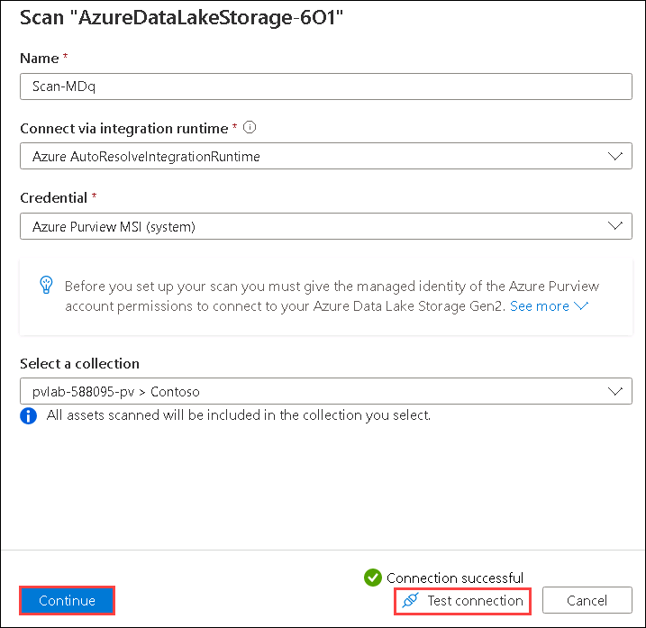

3. Expand the hierarchy to see which assets will be within the scans scope, and click **Continue**.

    

4. Select the system default scan rule set and click **Continue**.

    > :bulb: **Did you know?**
    >
    > [Scan Rule Sets](https://docs.microsoft.com/en-us/azure/purview/create-a-scan-rule-set) determine which **File Types** and **Classification Rules** are in scope. If you want to include a custom file type or custom classification rule as part of a scan, a custom scan rule set will need to be created.

    

5. Select **Once** and click **Continue**.

    

6. Click **Save and Run**.

    

7. To monitor the progress of the scan run, click **View Details**.

    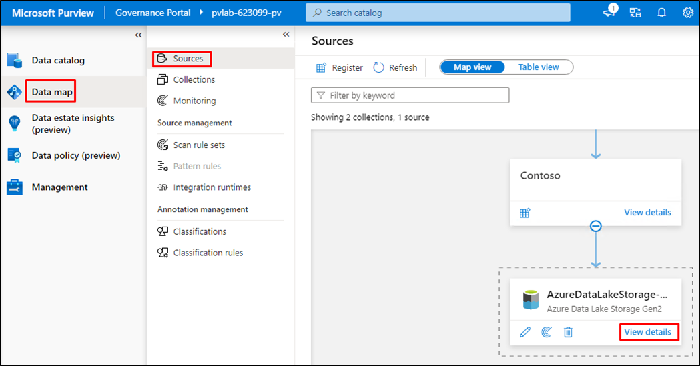

8. Click **Refresh** to periodically update the status of the scan. Note: It will take approximately 5 to 10 minutes to complete.

    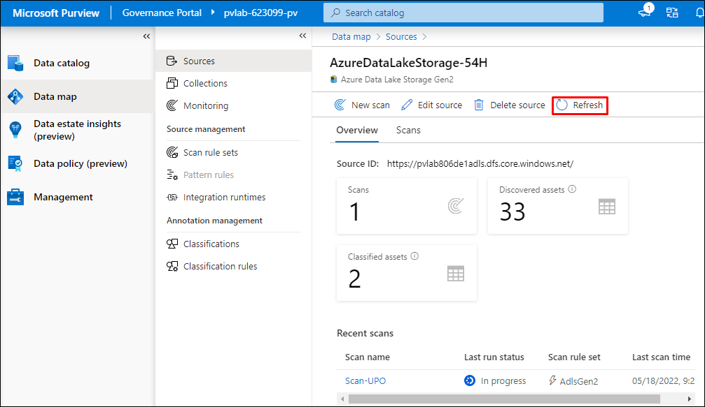

## 6. View Assets

1. Navigate to **Purview Studio** > **Data catalog**, and perform a wildcard search by typing the asterisk character (`*`) into the search box and hit the Enter key to submit the query.

    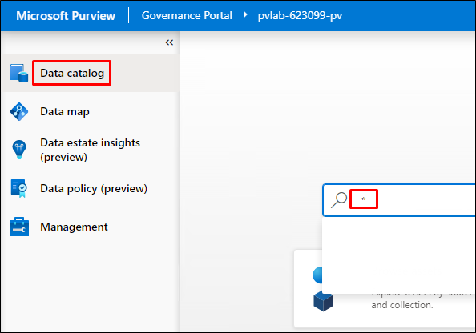

2. You should be able to see a list of assets within the search results, which is a result of the scan.

    

## :mortar_board: Knowledge Check

[http://aka.ms/purviewlab/q02](http://aka.ms/purviewlab/q02)

1. What type of object can help organize data sources into logical groups?

    A ) Buckets    
    B ) Collections  
    C ) Groups  

2. At which point does Microsoft Purview begin to populate the data map with assets?

    A ) After an Microsoft Purview account is created  
    B ) After a Data Source has been registered    
    C ) After a Data Source has been scanned

3. Which of the following attributes is **not** automatically assigned to an asset as a result of the system-built scanning functionality?

    A ) Technical Metadata (e.g. Fully Qualified Name, Path, Schema, etc)  
    B ) Glossary Terms (e.g. column `Sales Tax` is tagged with the `Sales Tax` glossary term)  
    C ) Classifications (e.g. column `ccnum` is tagged with the `Credit Card Number` classification)  

## :tada: Summary

This module provided an overview of how to create a collection, register a source, and trigger a scan.
