# Module 02B - Register & Scan (Azure SQL DB)

## :loudspeaker: Introduction

To populate Microsoft Purview with assets for data discovery and understanding, we must register sources that exist across our data estate so that we can leverage the out of the box scanning capabilities. Scanning enables Microsoft Purview to extract technical metadata such as the fully qualified name, schema, data types, and apply classifications by parsing a sample of the underlying data.

In this module, you'll walk through how to register and scan data sources. You'll create a new collection for your first data source, upload data and configure scanning. By the end of this module you'll have technical metadata, such as schema information, stored in Purview. You can use this to start linking to business terms, allowing your team members to find data more easily.

## :dart: Objectives

* Register and scan an Azure SQL Database using SQL authentication credentials stored in Azure Key Vault.

## :bookmark_tabs: Table of Contents

| #  | Section | Role |
| --- | --- | --- |
| 1 | [Key Vault Access Policy #1 (Grant Yourself Access)](#1-key-vault-access-policy-1-grant-yourself-access) | Azure Administrator |
| 2 | [Key Vault Access Policy #2 (Grant Microsoft Purview Access)](#2-key-vault-access-policy-2-grant-azure-purview-access) | Azure Administrator |
| 3 | [Generate a Secret](#3-generate-a-secret) | Azure Administrator |
| 4 | [Add Credentials to Microsoft Purview](#4-add-credentials-to-azure-purview) | Microsoft Purview Administrator |
| 5 | [Register a Source (Azure SQL DB)](#5-register-a-source-azure-sql-db) | Data Source Administrator |
| 6 | [Scan a Source with Azure Key Vault Credentials](#6-scan-a-source-with-azure-key-vault-credentials) | Data Source Administrator |
| 7 | [View Assets](#7-view-assets) | Data Reader |

## 1. Key Vault Access Policy #1 (Grant Yourself Access)
    
> :bulb: **Did you know?**
>
> **Azure Key Vault** is a cloud service that provides a secure store for secrets. Azure Key Vault can be used to securely store keys, passwords, certificates, and other secrets. For more information, check out [About Azure Key Vault](https://docs.microsoft.com/en-us/azure/key-vault/general/overview).

Before we can add secrets (such as passwords) to Azure Key Vault, we need to set up an [Access Policy](https://docs.microsoft.com/en-us/azure/key-vault/general/assign-access-policy?tabs=azure-portal). The access policy being created in this particular step, ensures that our account has sufficient permissions to create a secret, which will later be used by Microsoft Purview to perform a scan.

1. Navigate back to the browser tab in which Azure Portal is open, select the **purviewlab-rg** resource group and then Azure Key Vault resource named **pvlab-kv{randomid}**.

    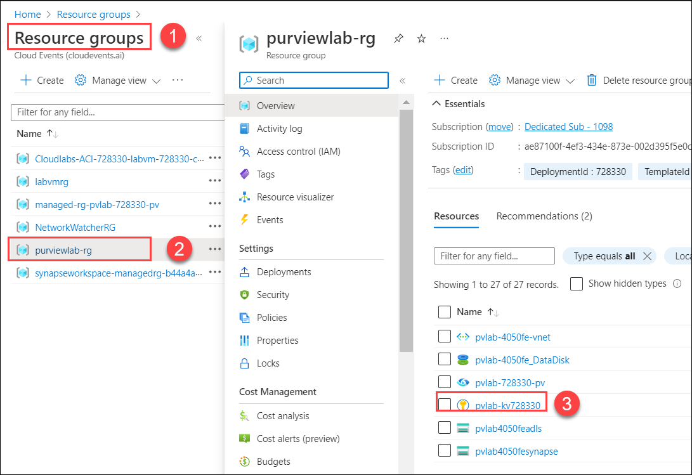

1. Select **Access policies** from the Key Vault menu.
    
    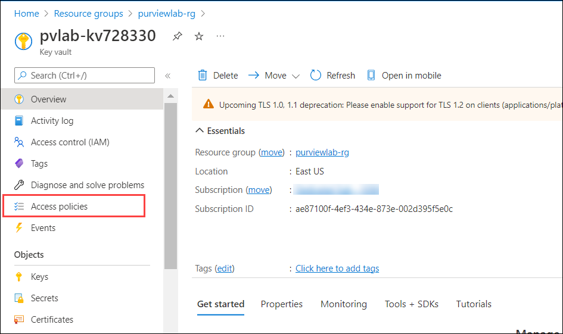

1. Click **create**.

    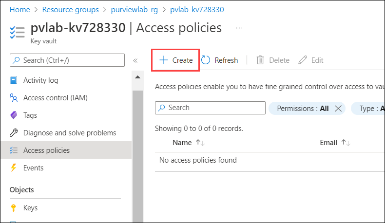

1. Under **Permission**, select **secret permission(1)**,click on  **select all(2)** and click on **Next(3)**.

    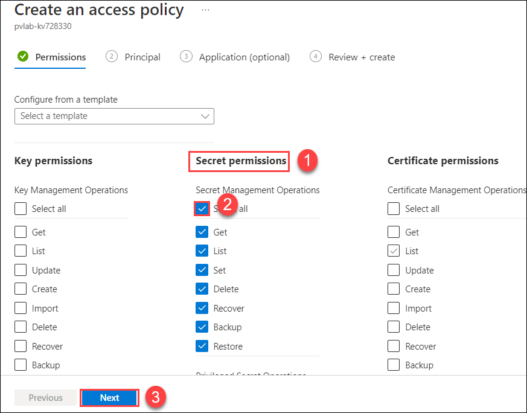

1. Under **Principal**, Search for **odl_user_<inject key="Deployment ID" enableCopy="true"/>**, select the account name, then click **Next**.

    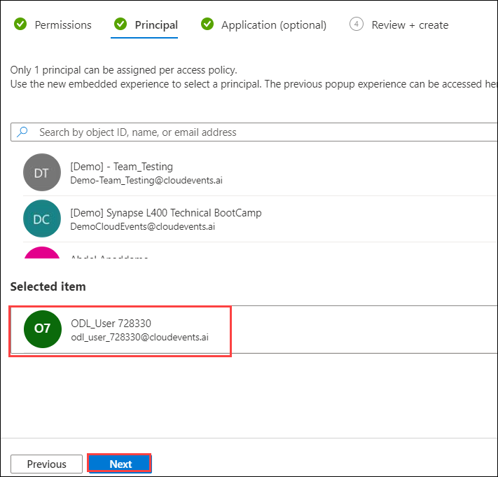

1. Under **Appliction** leave everything as default and click on **Next**.
   
    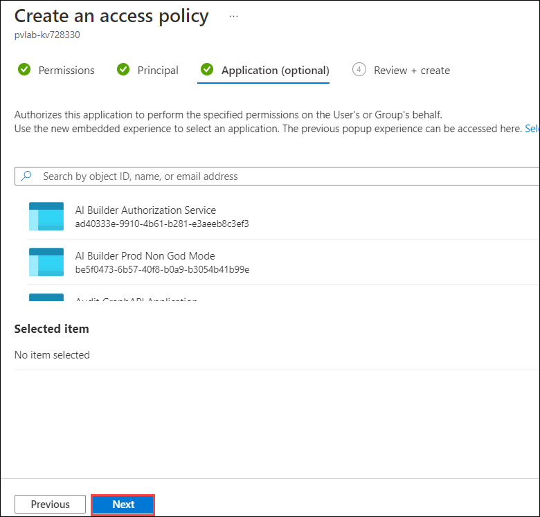

1. Under **Review + create** click on **create**.

    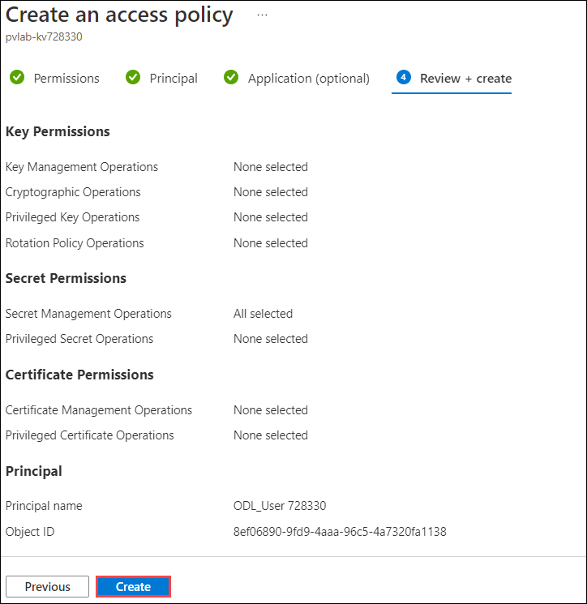

1. Make sure that keyvault updation is success.

    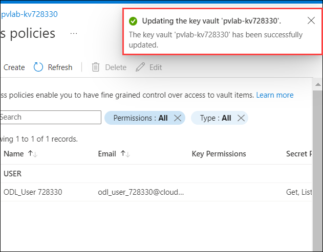

## 2. Key Vault Access Policy #2 (Grant Microsoft Purview Access)

In this next step, we are creating a second access policy which will provide Microsoft Purview the necessary access to retrieve secrets from the Key Vault.


1.  Under keyvault named **pvlab-kv{randomid}** under Access policies Click **create**.

    

1. Under **Permission**, select **secret permission(1)**,click on  **select Get,List(2)** and click on **Next(3)**.

    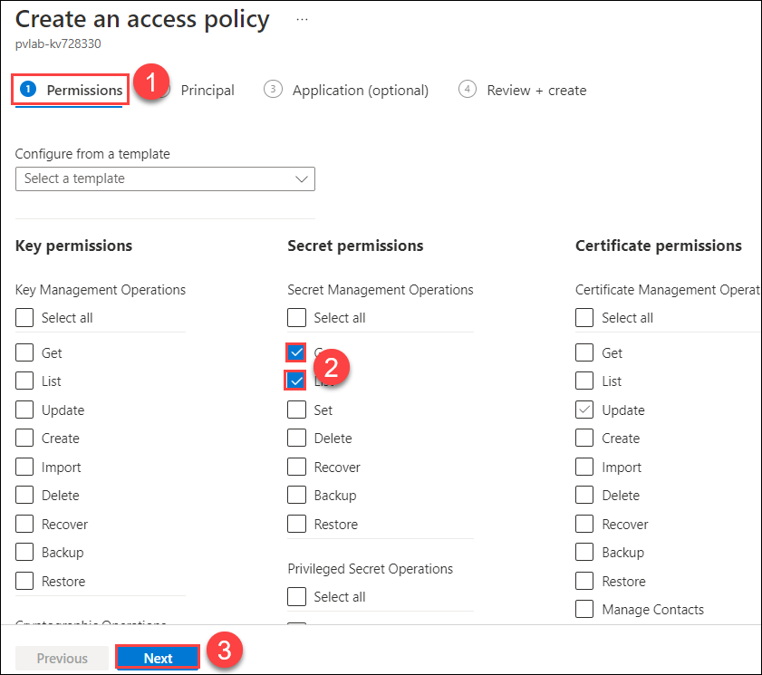

1. Under **Principal**, Search for **pvlab-<inject key="Deployment ID" enableCopy="true"/>-pv**, select the account name, then click **Next**.

    

1. Under **Appliction** leave everything as default and click on **Next**.
   
    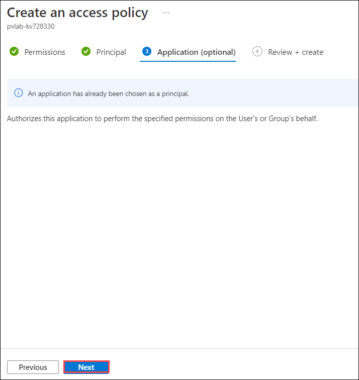

1. Under **Review + create** click on **create**.

    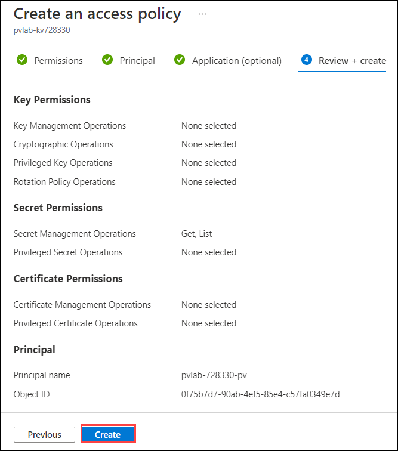

1. Make sure that keyvault updation is success.

    

## 3. Generate a Secret

In order to securely store our Azure SQL Database password, we need to generate a secret.

1. Navigate to **Secrets** and click **Generate/Import**.

    

2. **Copy** and **paste** the values below into the matching fields and then click **Create**.

    **Name**
    ```
    sql-secret
    ```
    **Value**
    ```
    sqlPassword!
    ```

    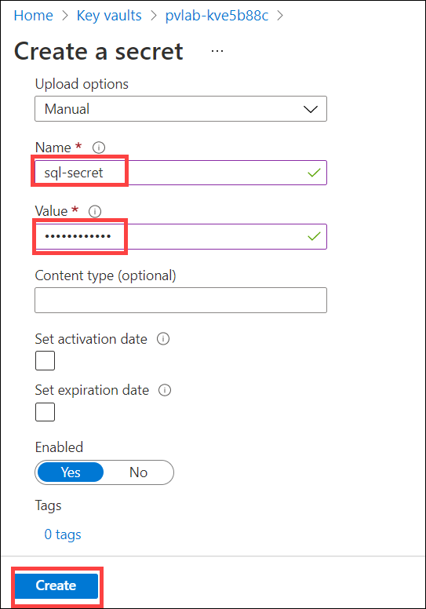

## 4. Add Credentials to Microsoft Purview

To make the secret accessible to Microsoft Purview, we must first establish a connection to Azure Key Vault.

1. Navigate back to the browser tab in which **Purview Studio** is open, then to this path **Management Center** > **Credentials**, click **Manage Key Vault connections**.

    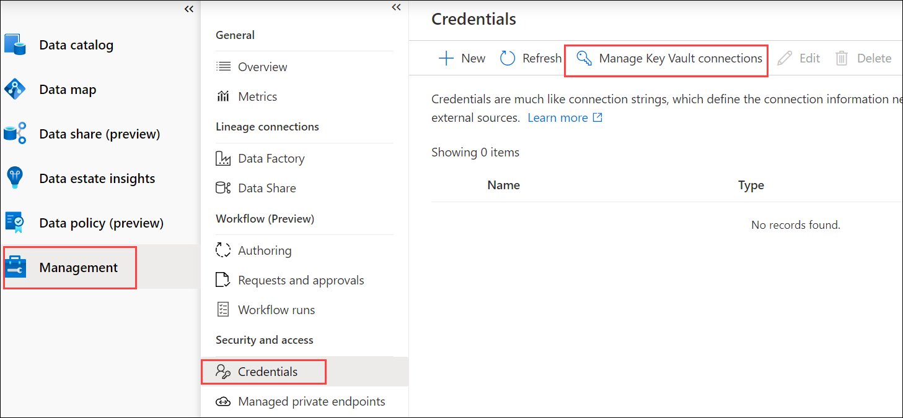

2. Click **New**.

    

3. **Copy** and **paste** the value below to set the name of your **Key Vault connection**, and then use the drop-down menu items to select the appropriate **Subscription** and **Key Vault** named **pvlab-kv{randomid}**, then click **Create**.

    **Name**
    ```
    myKeyVault
    ```

    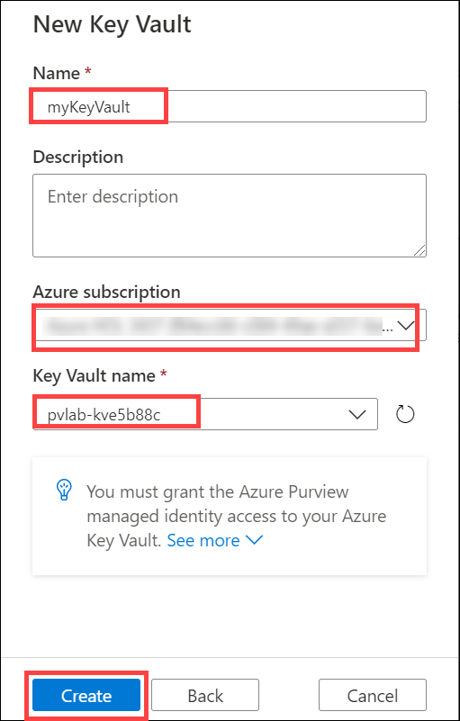

4. Since we have already granted the Microsoft Purview managed identity access to our Azure Key Vault, click **Confirm**.

    

5. Click **Close**.

    

6. Under **Credentials** click **New**.

    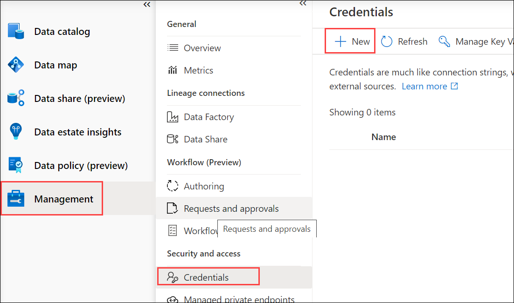

7.  Using the drop-down menu items, set the **Authentication method** to `SQL authentication` and the **Key Vault connection** to `myKeyVault`. Once the drop-down menu items are set, **Copy** and **paste** the values below into the matching fields, and then click **Create**.

    **Name**
    ```
    credential-SQL
    ```

    **User name**
    ```
    sqladmin
    ```

    **Secret name**
    ```
    sql-secret
    ```

    

## 5. Register a Source (Azure SQL DB)

1. From the Purview Studio, navigate to **Data map** > **Sources**, and click **Register**.

    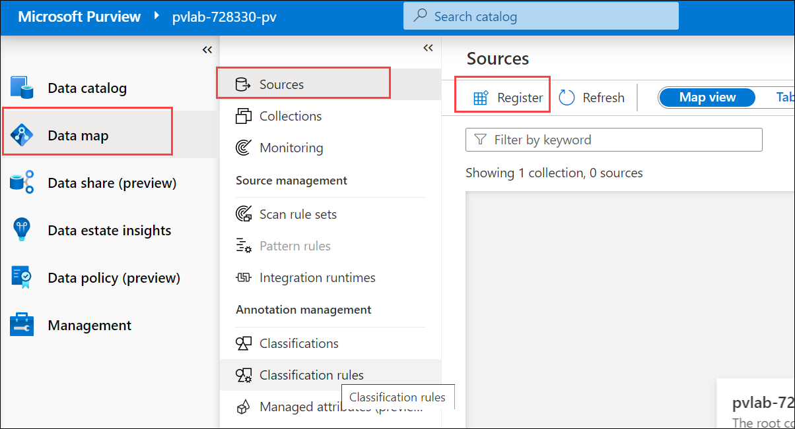

2. Navigate to the **Azure** tab, select **Azure SQL Database**, click **Continue**.

    

3. On the **Register sources (Azure SQL Database)** blade, enter the following information:

    - **Azure subscription**: Select your subscription from the dropdown.
    - **Server name**: Select **pvlab-{randomId}-sqlsvr** from the dropdown.
    - **Select a collection**: Select **pvlab-{randomId}-pv > Contoso** from the dropdown.
    -  Leave other values as default and click on **Register**.

    

## 6. Scan a Source with Azure Key Vault Credentials

1. From the Purview Studio, navigate to **Data map** > **Sources**, and within the Azure SQL Database tile, click the **New Scan** button.

    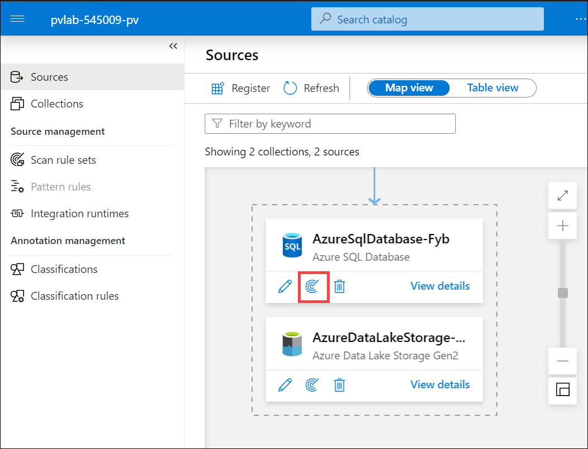

2. Select the **Database** named **pvlab-{randomId}-sqldb** and **Credential** named **credential-SQL** from the drop-down menus. Set **Lineage extraction (preview)** to **Off**. Click **Test connection**. Click **Continue**.

    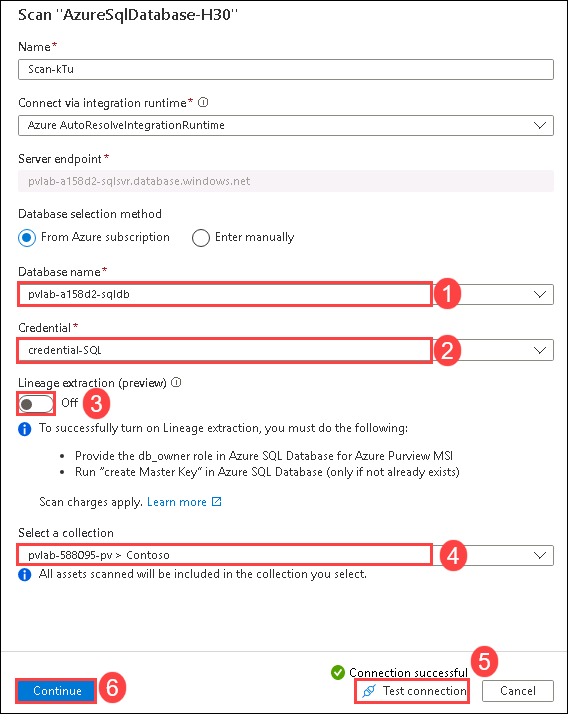

3. Click **Continue**.

    

4. Click **Continue**.

    

5. Set the trigger to **Once**, click **Continue**.

    

6. Click **Save and Run**.

    

7. To monitor the progress of the scan, click **View Details**.

    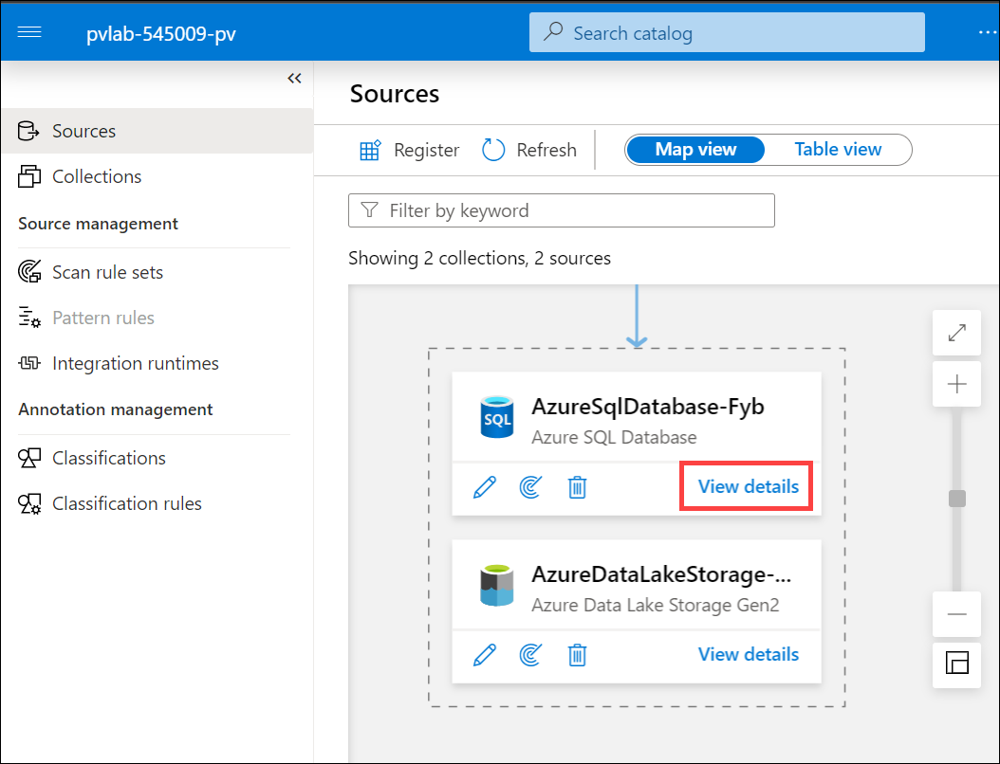

8. Click **Refresh** to periodically update the status of the scan. Note: It will take approximately 5 to 10 minutes to complete.

    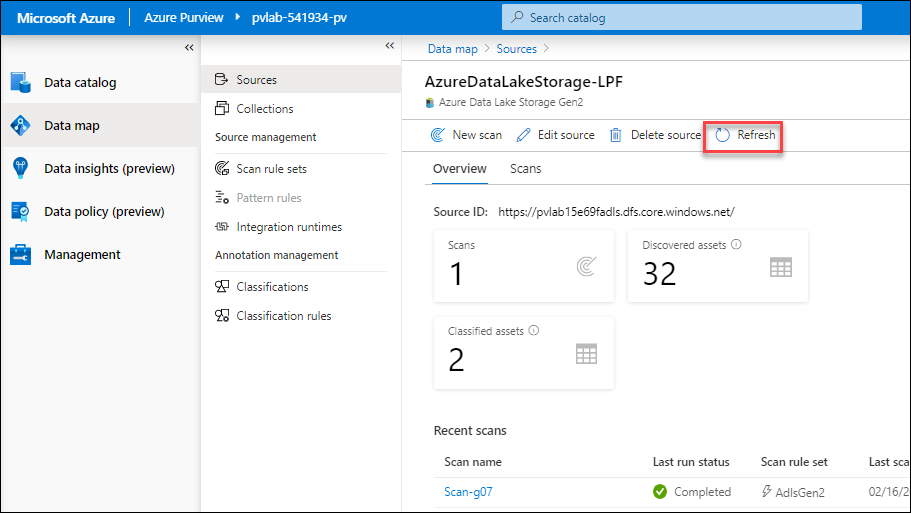

## 7. View Assets

1. To view the assets that have materialised as an outcome of running the scans, perform a wildcard search by typing the asterisk character (`*`) into the search bar and hit the Enter key to submit the query and return the search results.

    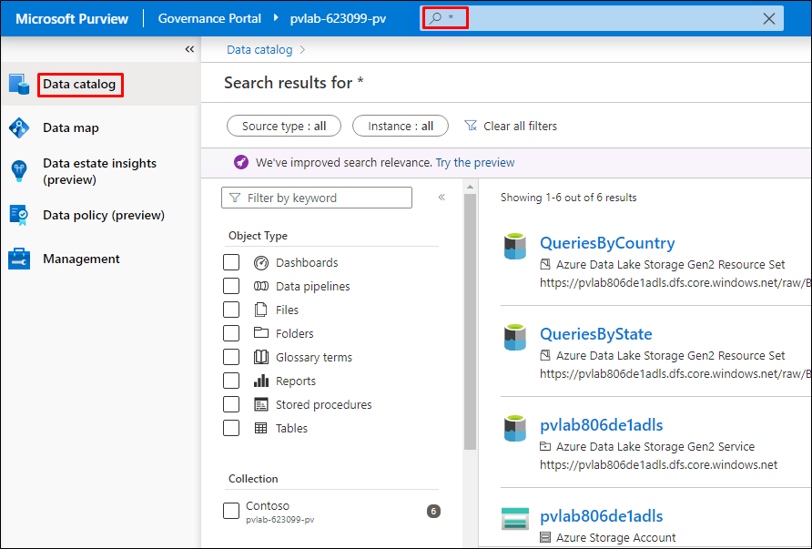

## :mortar_board: Knowledge Check

[http://aka.ms/purviewlab/q02](http://aka.ms/purviewlab/q02)

1. What type of object can help organize data sources into logical groups?

    A ) Buckets    
    B ) Collections  
    C ) Groups  

2. At which point does Microsoft Purview begin to populate the data map with assets?

    A ) After an Microsoft Purview account is created  
    B ) After a Data Source has been registered    
    C ) After a Data Source has been scanned

3. Which of the following attributes is **not** automatically assigned to an asset as a result of the system-built scanning functionality?

    A ) Technical Metadata (e.g. Fully Qualified Name, Path, Schema, etc)  
    B ) Glossary Terms (e.g. column `Sales Tax` is tagged with the `Sales Tax` glossary term)  
    C ) Classifications (e.g. column `ccnum` is tagged with the `Credit Card Number` classification)

## :tada: Summary

This module provided an overview of how to create a collection, register a source, and trigger a scan.
