# Module 06 - Lineage

## :loudspeaker: Introduction

One of the features of Microsoft Purview is the ability to show the lineage between datasets created by data processes. Data lineage shows how data moves over time and enables you to see how data is used and what changes to data have been made. This visibility helps you to understand, trace back and correct data at the source of origin. Lineage, thus also results into better data quality.

Lineage is typically captured from tools that extract, transform and load data. These ETL tools are, for example, Data Factory, Data Share, and Power BI. They capture the lineage of data as it moves. By scanning these ETL tools you can capture and visualize the lineage in Microsoft Purview.

Microsoft Purview also supports the ability to upload custom lineage. Custom lineage is lineage that you created yourself, for example by uploading metadata using the Microsoft Purview's Atlas REST APIs. Lineage in Purview includes relationships between datasets and processes.

> :bulb: **Did you know?**
>
> * **Dataset**: A dataset (structured or unstructured) provided as an input to a process. For example, a SQL Table, Azure blob, and files (such as .csv and .xml), are all considered datasets. In the lineage section of Purview, datasets are represented by **rectangular boxes**.
>
> * **Process**: An activity or transformation performed on a dataset is called a process. For example, ADF Copy activity, Data Share snapshot and so on. In the lineage section of Purview, processes are represented by **round-edged boxes**.

## :thinking: Prerequisites

* An [Azure account](https://azure.microsoft.com/free/) with an active subscription.
* An Azure Data Lake Storage Gen2 Account (see [module 00](../modules/module00.md)).
* An Azure Data Factory Account (see [module 00](../modules/module00.md)).
* A Microsoft Purview account (see [module 01](../modules/module01.md)).

This module steps through what is required for connecting an Azure Data Factory account with a Microsoft Purview account to track data lineage.

## :dart: Objectives

* Connect an Azure Data Factory account with an Azure Purview account.
* Trigger a Data Factory pipeline to run so that the lineage metadata can be pushed into Purview.

## :bookmark_tabs: Table of Contents

1. [Create an Azure Data Factory Connection in Azure Purview](#1-create-an-azure-data-factory-connection-in-azure-purview)
2. [Copy Data using Azure Data Factory](#2-copy-data-using-azure-data-factory)
3. [View Lineage in Azure Purview](#3-view-lineage-in-azure-purview)

## 1. Create an Azure Data Factory Connection in Azure Purview

1. Open the **Microsoft Purview Governance Portal**, navigate to **Management** > **Data Factory** (under Lineage connections) and click **New**.

    > :warning: To view/add/remove Data Factory connections, you need to be assigned the **Collection admin** role on the root collection.

    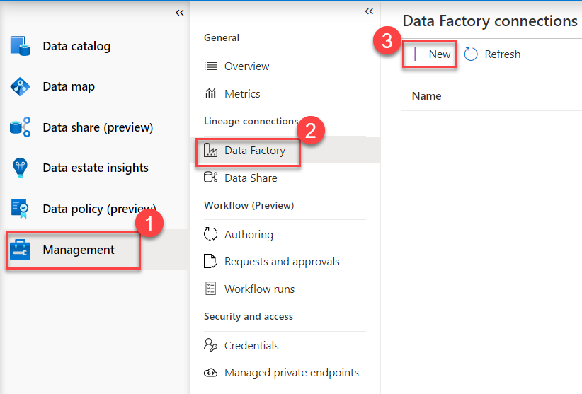

2. Select your Azure Data Factory account instance from the drop-down menu (e.g. `pvlab-{randomId}-adf`) and click **OK**.

    > :bulb: **Did you know?**
    >
    > Azure Purview can connect to **multiple** Azure Data Factories but each Azure Data Factory account can only connect to **one** Azure Purview account.

    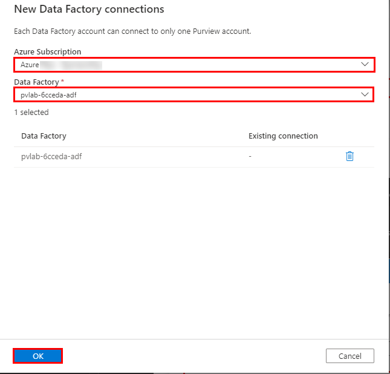

3. Once finished, you should see the Data Factory in a **connected** state.

    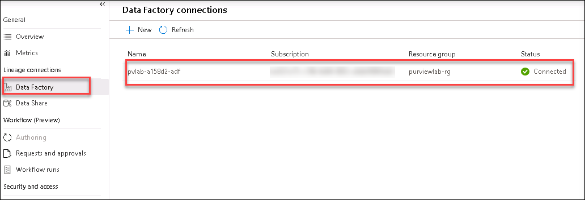

4. To confirm that Azure Data Factory has been provided the necessary access, navigate to **Data map** > **Collections** > `YOUR_ROOT_COLLECTION` > **Role assignments**, within **Data curators** you should be able to see the Azure Data Factory managed identity.

    > :bulb: **Did you know?**
    >
    > When a user creates an Azure Data Factory connection, behind the scenes the Data Factory managed identity is added to the `Data Curator` role. This provides Azure Data Factory the necessary access to push lineage to Azure Purview during a pipeline execution. See [supported Azure Data Factory activities](https://docs.microsoft.com/en-us/azure/purview/how-to-link-azure-data-factory#supported-azure-data-factory-activities) for more information.

    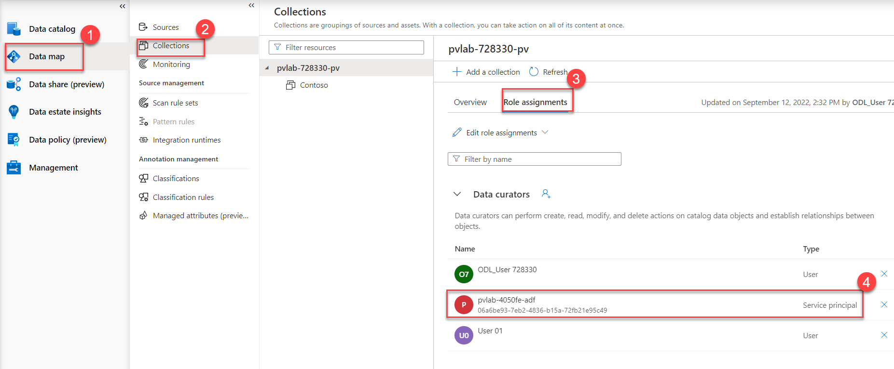

## 2. Copy Data using Azure Data Factory

1. Within the [Azure Portal](https://portal.azure.com), navigate to your Azure Data Factory resource and click **Open Azure Data Factory Studio**.

    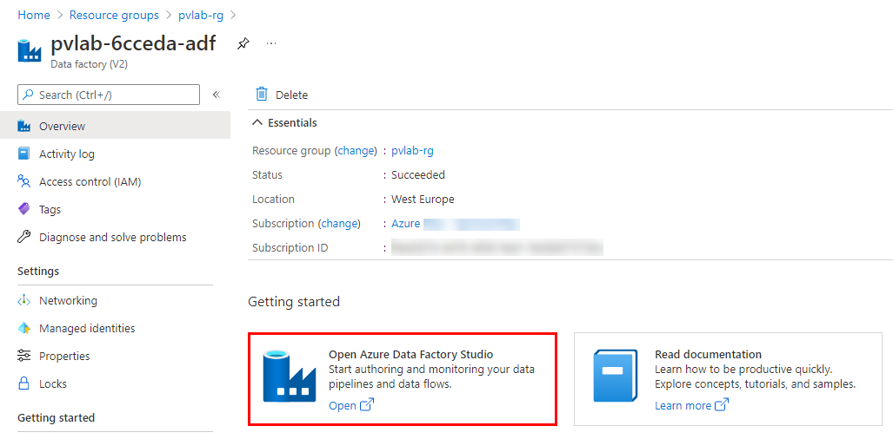

2. Click **Ingest**.
    

3. Select **Built-in copy task** and then click **Next**.

    

4. Change the **Source type** to `Azure Data Lake Storage Gen2` and then click **New connection**.
    
    

5. Select your **Azure subscription** and **Storage account** (e.g. `pvlab{randomId}adls`), click **Test connection** and then click **Create**.

    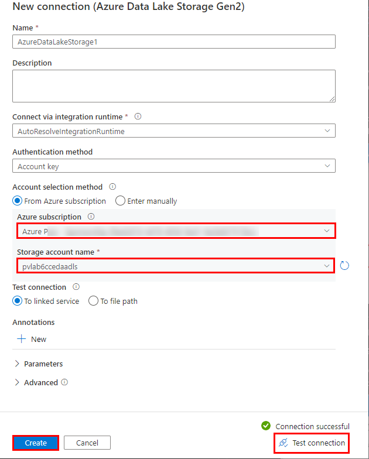

8. Click **Browse**.

    

9. Navigate to `raw/BingCoronavirusQuerySet/2020/` and click **OK**.
    
    

10. Confirm your folder path selection and click **Next**.

    

11. Preview the sample data by clicking **Preview data**, and then click **Next**.
    
    

13. Change the **Destination type** to `Azure Data Lake Storage Gen2`, set the **Connection** to the existing connection (e.g. `AzureDataLakeStorage1`), and then click **Browse**.

    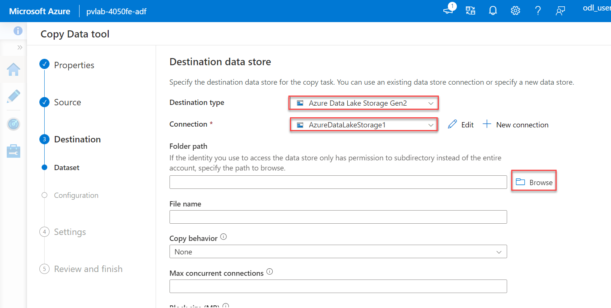

14. Navigate to `raw/` and click **OK**.

    

15. Confirm your folder path selection, set the **file name** to `2020_merged.parquet`, set the **copy behavior** to **Merge files**, and click **Next**.

    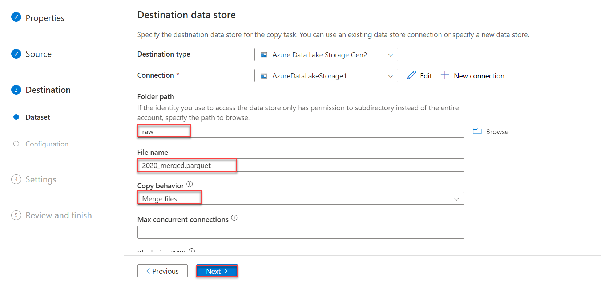

16. Set the **file format** to **Parquet** and click **Next**.

    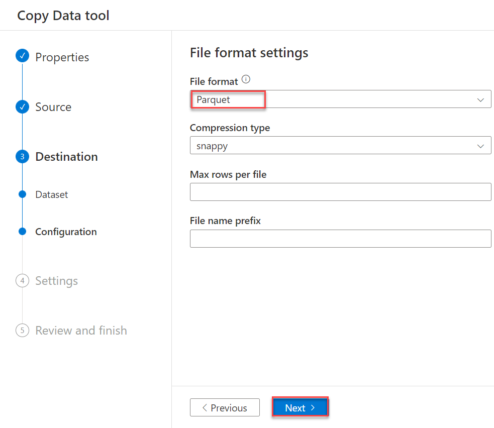

17. Leave the default settings and click **Next**.

    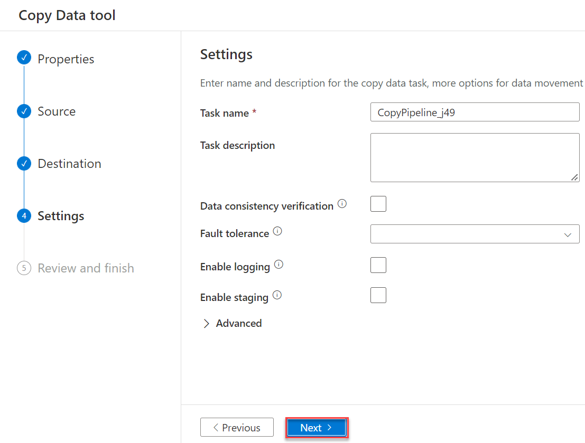

18. Review the summary and proceed by clicking **Next**.

    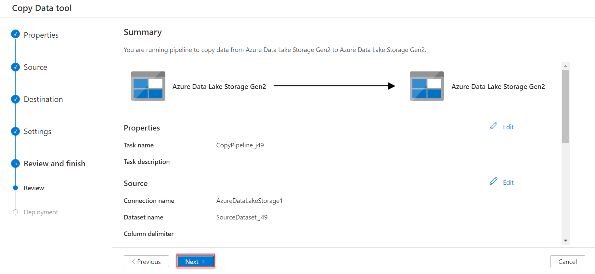

19. Once the deployment is complete, click **Finish**.

    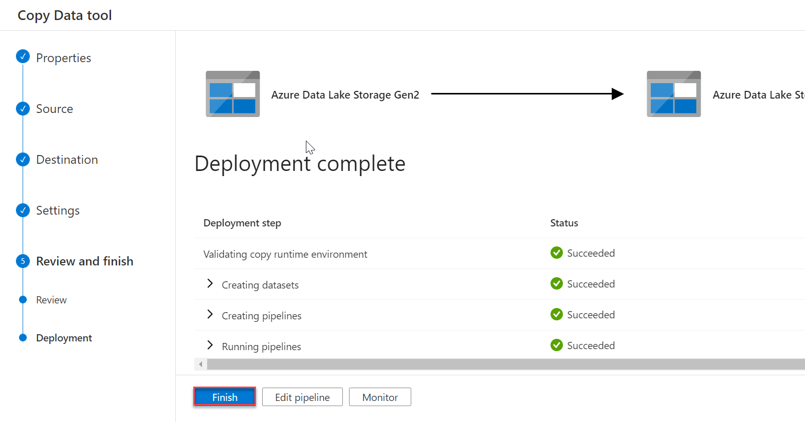

20. Navigate to the **Monitoring** screen to confirm the pipeline has run **successfully**.

    

## 3. View Lineage in Azure Purview

1. Navigate back to the Purview Studio, from the **Data catalog** screen click **Browse assets**.

    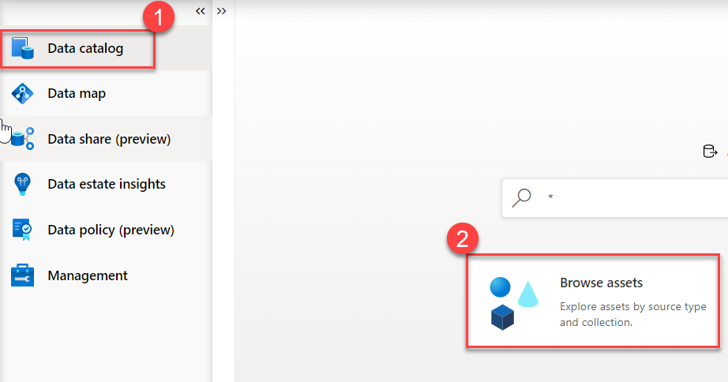

2. Switch to the **By source type** tab and then select **Azure Data Factory**.

    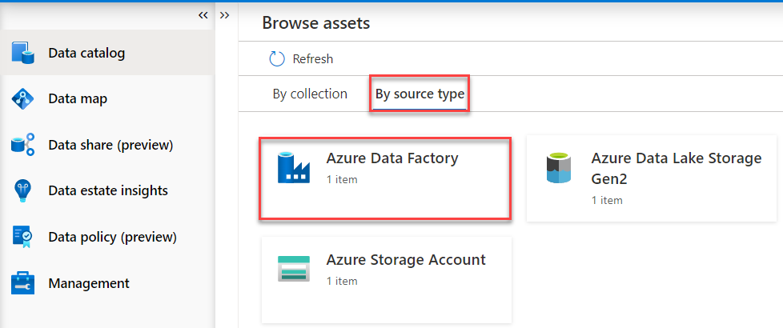

3. Select the **Azure Data Factory account instance**.

    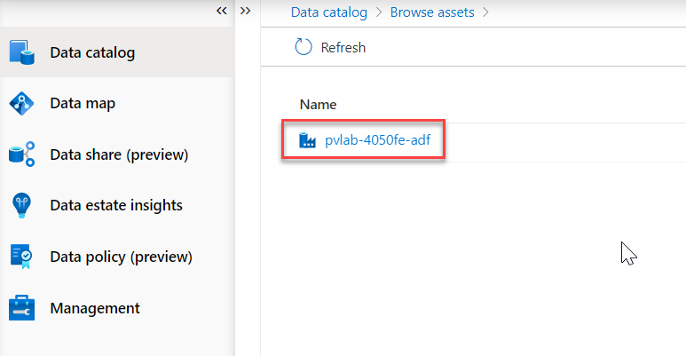

4. Select the **Copy Pipeline** and click to open the **Copy Activity**.
    
    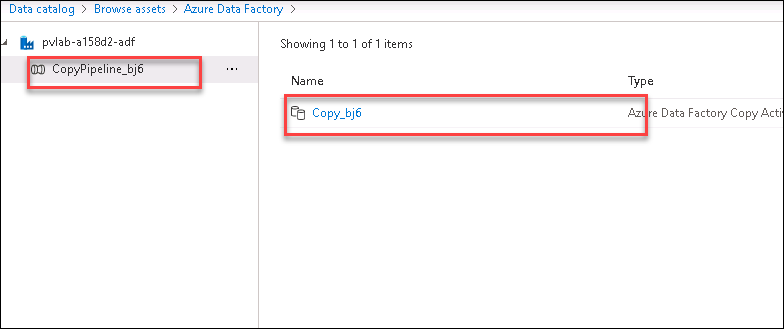

5. Navigate to the **Lineage** tab.

6. You can see the lineage information has been automatically pushed from Azure Data Factory to Purview. On the left are the two sets of files that share a common schema in the source folder, the copy activity sits in the center, and the output file sits on the right.

    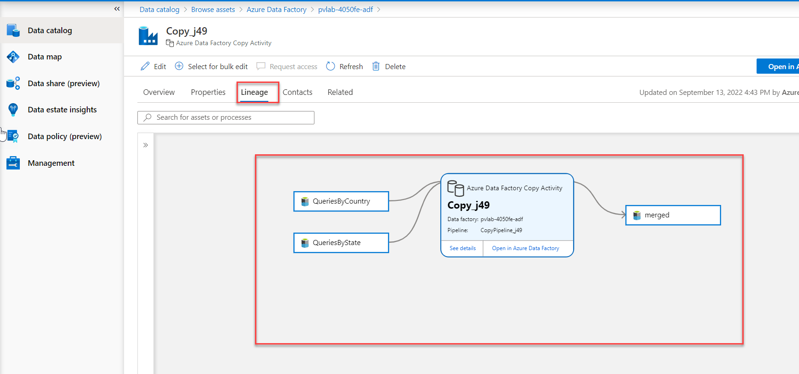

## :mortar_board: Knowledge Check
[http://aka.ms/purviewlab/q06](http://aka.ms/purviewlab/q06)

1. An Azure Purview account can connect to multiple Azure Data Factories?

    A ) True  
    B ) False

2. An Azure Data Factory can connect to multiple Azure Purview accounts?

    A ) True  
    B ) False  

3. ETL processes are rendered on the lineage graph with what type of edges?

    A ) Squared edges  
    B ) Rounded edges  

## :tada: Summary

This module provided an overview of how to integrate Azure Purview with Azure Data Factory and how relationships between assets and ETL activities can be automatically created at run time, allowing us to visually represent data lineage and trace upstream and downstream dependencies.
