# Module 11 - Securely scan sources using Self-Hosted Integration Runtimes

[< Previous Module](../modules/module10.md) - **[Home](../README.md)** - [Next Module >](../modules/module12.md)

## :loudspeaker: Introduction

Microsoft Purview comes with a managed infrastructure component called AutoResolveIntegrationRuntime. This component is required when scanning sources and most useful when connecting to data stores and computes services with public accessible endpoints. However some of your sources might be VM-based or can be applications that either sit in a private network (VNET) or other networks, such as on-premises. For these kind of scenarios a Self-Hosted Integration Runtime (SHIR) is recommended.

In this lab you learn how to setup a more complex scenario of using a SHIR and private virtual network. First, you'll deploy a virtual network and storage account, then you will deploy and use private endpoints to route all traffic securely, without using any public accessible endpoints. Lastly, you configure the SHIR, Azure Key Vault and configure everything in Microsoft Purview.

## :thinking: Prerequisites

- An [Azure account](https://azure.microsoft.com/free/) with an active subscription.
- A Microsoft Purview account (see [module 01](../modules/module01.md)).

## :dart: Objectives

- Connect to on premise data source using a self-hosted integration runtime.

## :bookmark_tabs: Table of Contents

1. [Virtual network creation](#1-virtual-network-creation)
2. [Storage account creation](#2-storage-account-creation)
3. [Private endpoint creation](#3-private-endpoint-creation)
4. [Self-hosted integration runtime installation](#4-self-hosted-integration-runtime-installation)
5. [Key vault creation](#5-key-vault-creation)
6. [Key Vault configuration within Microsoft Purview](#6-key-vault-configuration-within-purview)
7. [Summary](#7-summary)

<div align="right"><a href="#module-11---securely-scan-sources-using-self-hosted-integration-runtimes">↥ back to top</a></div>

## 1. Virtual network creation

1. Navigate back to the tab where the Azure Portal is open, search for **Virtual Network**. 

> **Note**: For deploying your Self-Hosted Integration Runtime you first need to create a new virtual network. This is needed for the virtual machine and private endpoint to be created.
  
  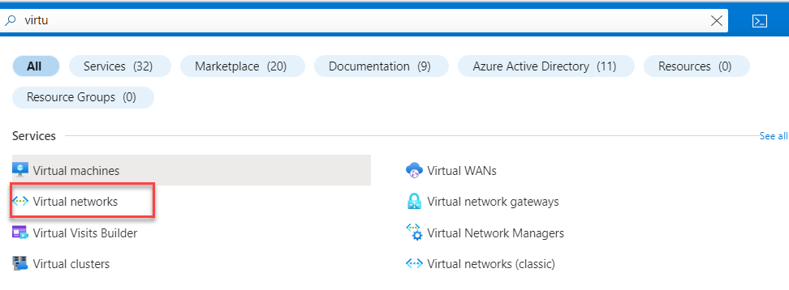

2. Click **Create** in the Virtual network page.
 
 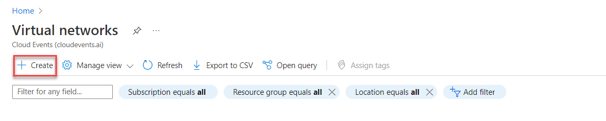

3.  In the **Create Virtual Network** tab select your subcription, from the drop down for **Resource Group** select **purviewlab-rg**

  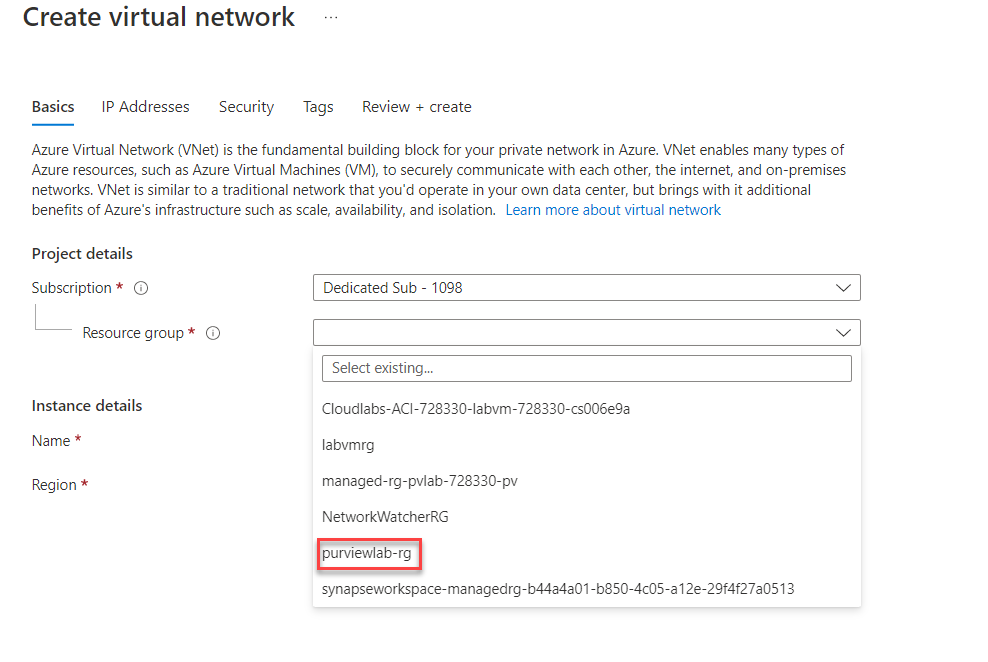

4. Provide a unique name for your Virtual Network and your desired region, click on **Next: IP Addresses>**.
  
  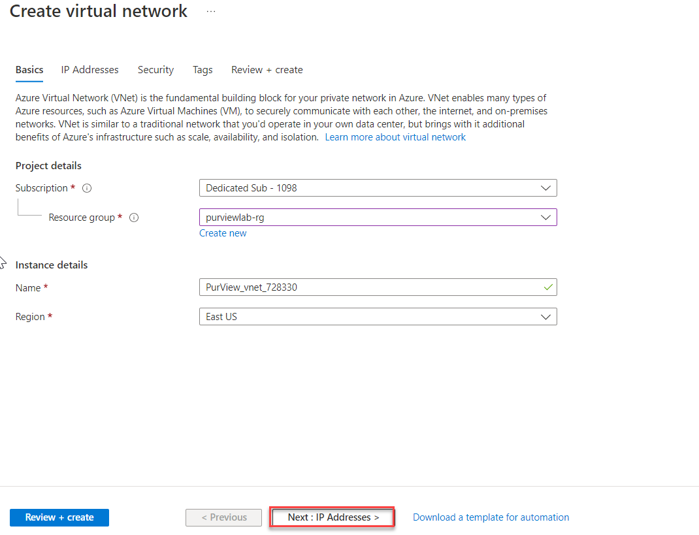

5.  On the **IP Addresses** review the proposed configuration and select **Review+Create** to create the **Virtual Network**.

   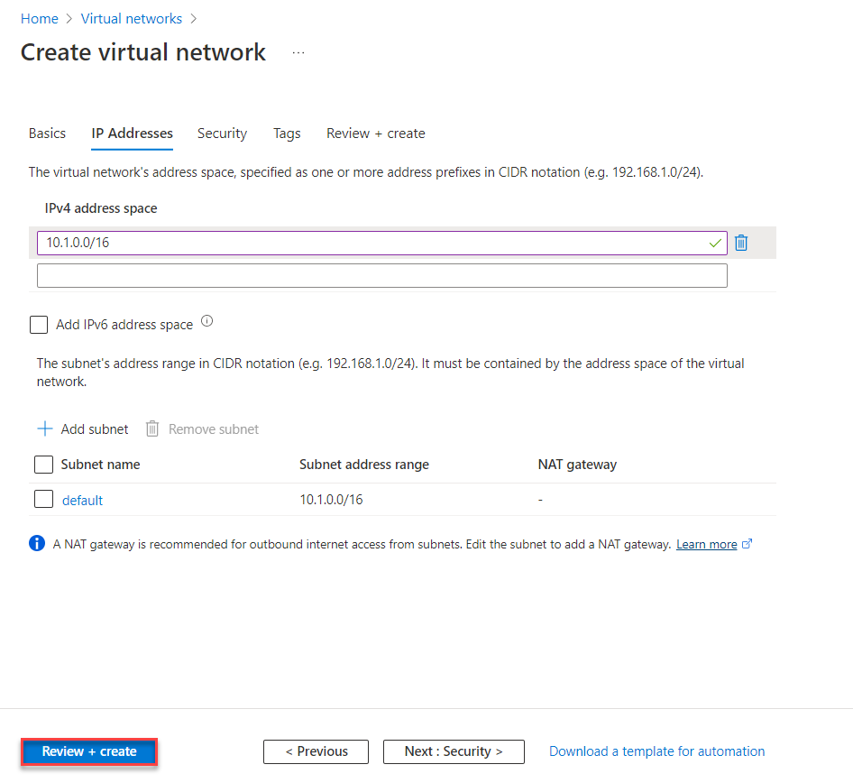

<div align="right"><a href="#module-11---securely-scan-sources-using-self-hosted-integration-runtimes">↥ back to top</a></div>

## 2. Storage account creation

1.  On the Azure Portal home page select create new resource. Select the resource group you just created, provide a unique name, and hit next.
 
 > **Note**: We will setup a storage account for demonstration. This is the resource that will be scanned during this demo.
   
   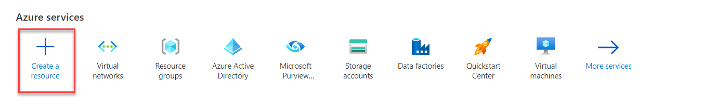

2. Search Storage Account and select **Create**.

   
3. On the **Create Storage Account** tab, select your subcription, and from the dropdown for **Resource Group** select **purviewlab-rg**. 
   
  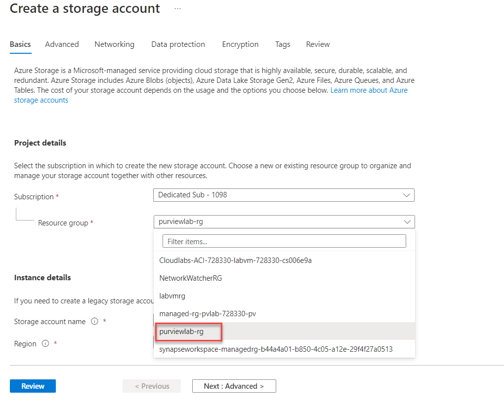
4. Provide a unique name for your storage account and click **Next: Advanced>**.
  
   

5. In the **Advanced** section of **Create Storage Account** ensure that **hierarchical namespaces** are selected. Click next to jump over to the **Networking tab**.

   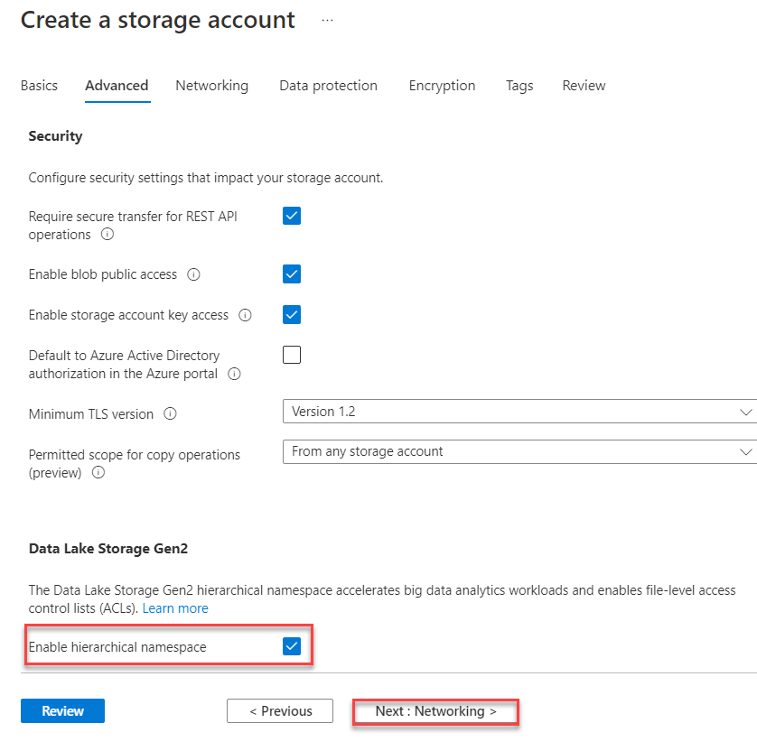

6. In the **Networking** tab, select **Disable public access and use private access** as the **Network Access**. Don’t create any private endpoints at this stage. This comes later. Then hit **Review**.

   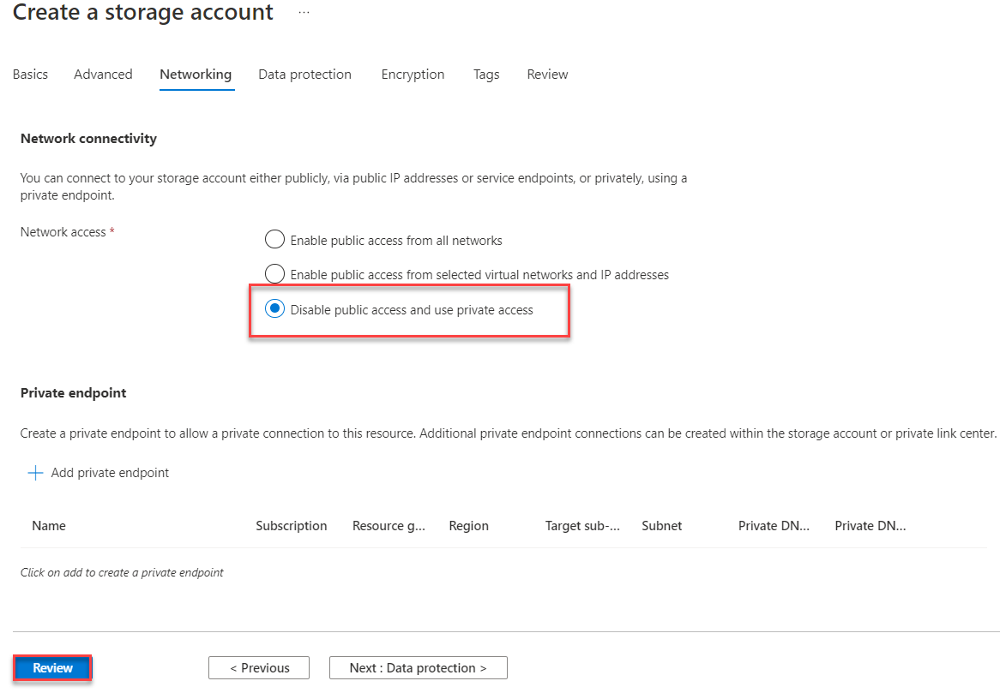

7. Click **Create** to create the storage account.
    
    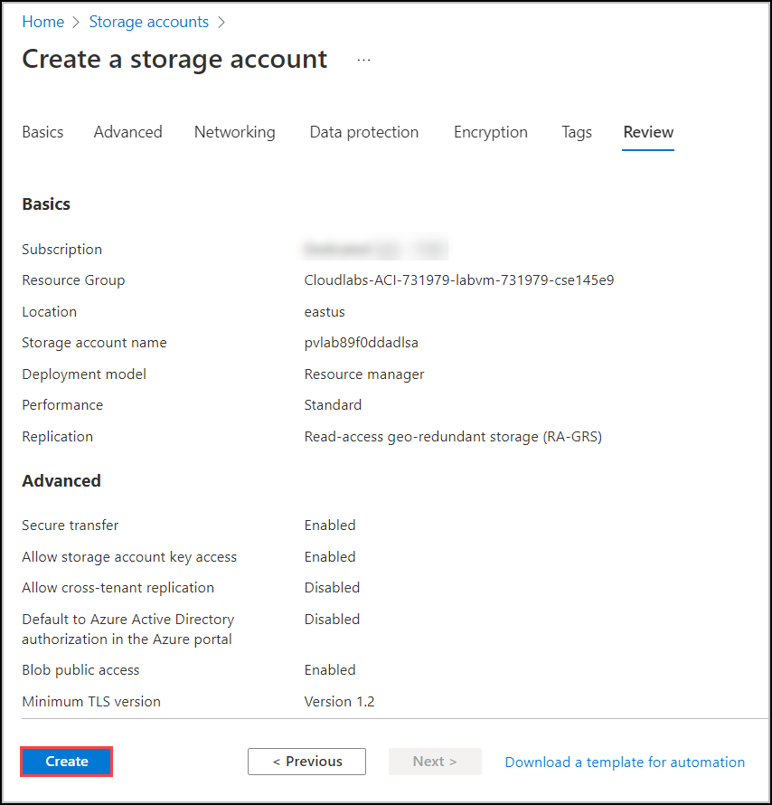

<div align="right"><a href="#module-11---securely-scan-sources-using-self-hosted-integration-runtimes">↥ back to top</a></div>

## 3. Private endpoint creation

Your next step is creating a private endpoint: a network interface that uses a private IP address from your virtual network. This network interface connects you privately and securely to your storage account. It also means all network traffic is routed internally, which is useful to mitigate network exfiltration risks.

1. For creating a new private endpoint, go to your storage account. Click on **Networking**(1) on the left side. Go to **Private endpoint connections**(2) and click on the **+ Private endpoint**(3) icon.

   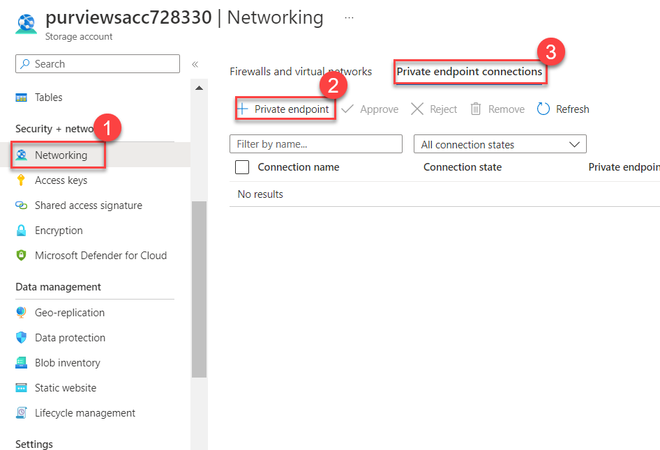

2. On the basics tab provide a name. This will be name of your **Network Interface** created in the virtual network. Click on **Next:Resource>**

   
   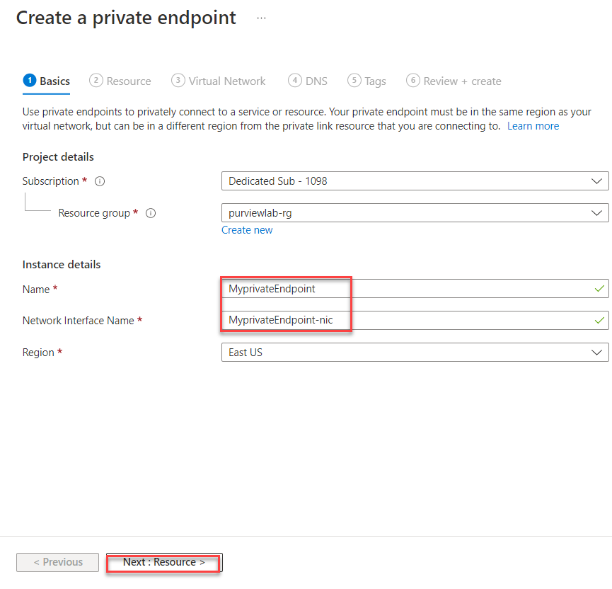


3. Next on the **Resource** tab, you need to select which resource type you want to expose. For this demo we will use blob, from the dropdown select blob for **Target sub-resource**. Click on **Next: Virtual Network>**.

   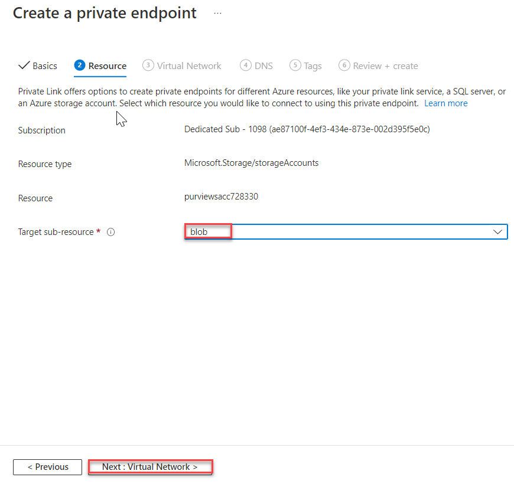

4. The last configuration is selecting which virtual network the private endpoint must be deployed within. You should use the virtual network which you created in the previous steps. For the Private IP configuration you can select to dynamically allocate IP addresses.

   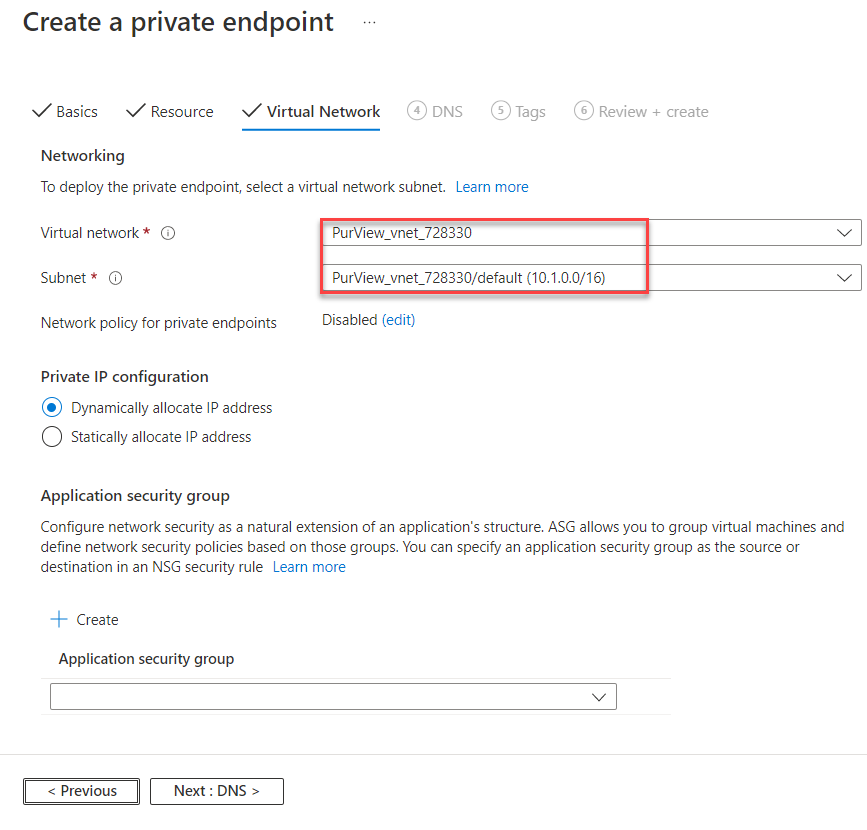
 
 5. Leave rest of the configurations default and click **Create**

   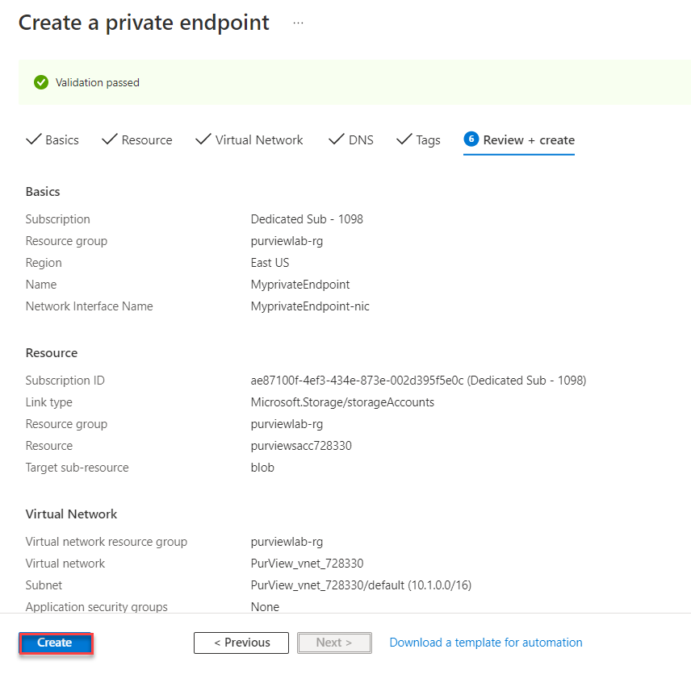

6. After creating the endpoint return to the network overview settings, Go back to the **Firewall and virtual networks**(1) settings within your Storage Account. Under Public network access select **Enabled from selected virtual networks and IP addresses**(2), select **Add existing virtual network**(3) under Virtual networks. On the Add network pane select your **virtual network**(4) and **subnet**(5) from the list that you created previously, and click **Enable**(6) and **Add**. Then select **Save**(7).

   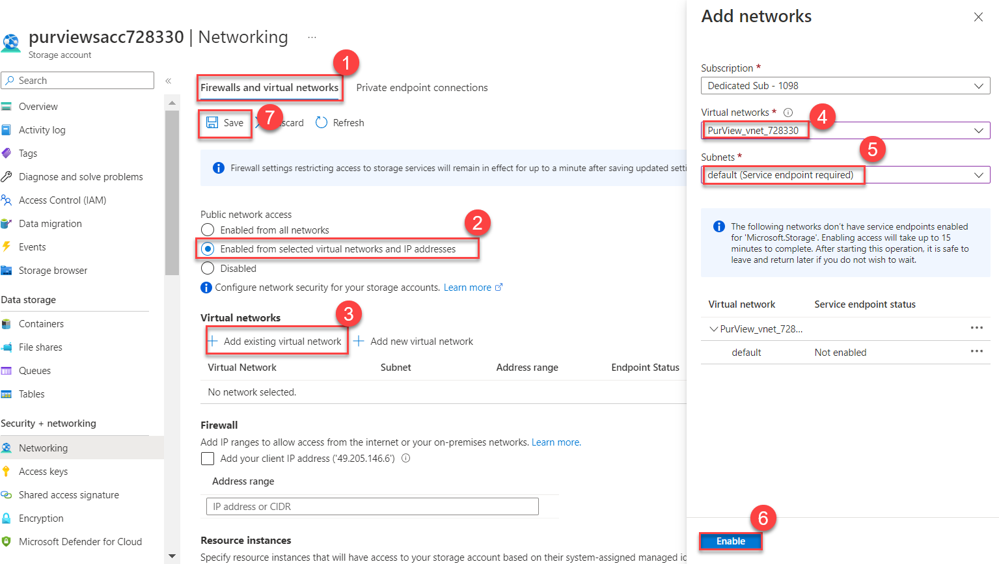

7. After this configuration you’re set. Let’s continue and setup your virtual machine.

<div align="right"><a href="#module-11---securely-scan-sources-using-self-hosted-integration-runtimes">↥ back to top</a></div>

## 4. Self-hosted integration runtime installation

A self-hosted integration runtime is a software component that scans for metadata. You can install on many different types of (virtual) machines. You can download it from the following location: [https://www.microsoft.com/download/details.aspx?id=39717](https://www.microsoft.com/download/details.aspx?id=39717)

For this demo you will be using Windows 10. Open the Azure Portal again to search for virtual machines.

1. On the Azure portal search bar type **Virtual Machine** and select, in the virtual machine tab select **Create** in the dropdown select **Azure virtual machine**. 

   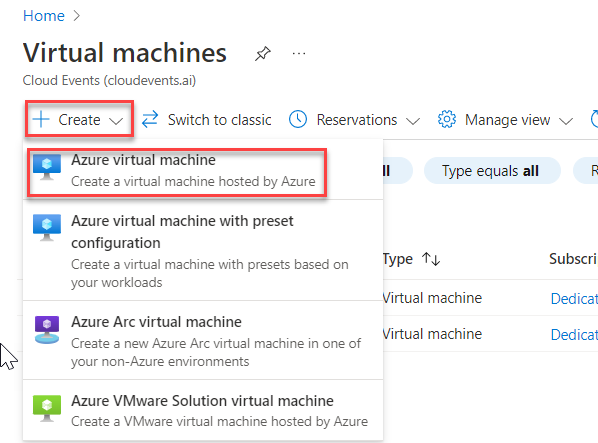

2. In the **Create virtual machine** pane on **Basics** tab enter the following value. After the virtual machine has been created, download the RDP file for easily taking over remote control.

|Settings|Value|
|---|---|
|Resource Group|purviewlab-rg|
|Virtual machine name|pur-M11-VM|
|Image|Windows 10 pro|
|Username|demouser|
|Password|demo!pass123|


   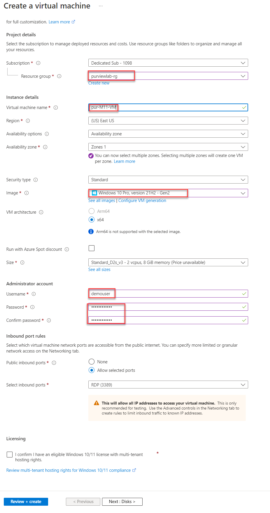

3. In the **Create virtual machine** pane select **Networking** and ensure the virtual network created in the previous task is selected and select **Review+Create**
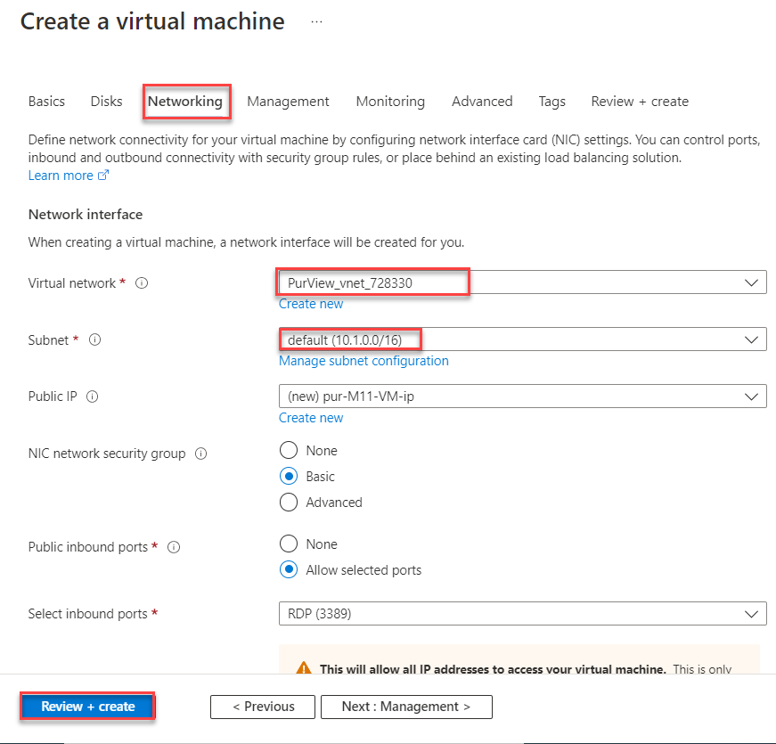

4. Once the Virtual Machine is created **go to resource** on the deployment page, select **Connect**(1) on the left pane under **Settings** and select **RDP**(2) and **Download RDP file**(3)

      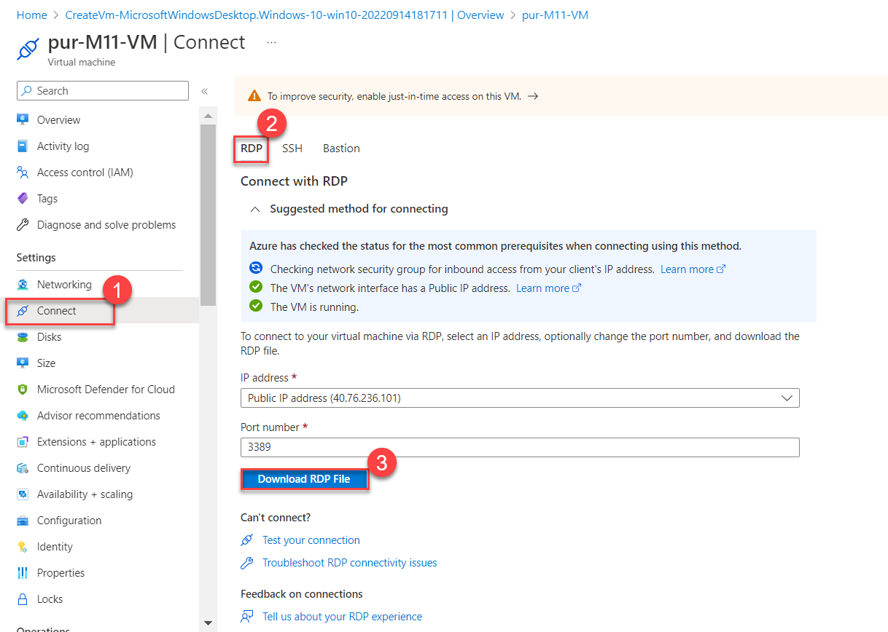

5. After downloading your RDP file, open it and enter your username and password from the previous section. If everything goes well, you should be connected and see the virtual machine’s desktop. To validate that your private endpoint works correctly, open CMD and type:

   ```text
   nslookup storageaccountname.blob.core.windows.net
   ```

6. If everything works correctly, the privatelink.blob.core.windows.net should show up in the list. This means is that your default access location has become an alias for an internal address. Although you use a public name, network is routed internally via the virtual network.

      

7. When everything is working, you must download the self-hosted integration runtime package. To do this navigate to the **Azure purview portal** on your browser. Select **Data map** and go to **Integration runtimes** select **+ New**

      

8. On the **Intergartion run time setup** pane select **Self hosted**, and **Continue**.
  
 
      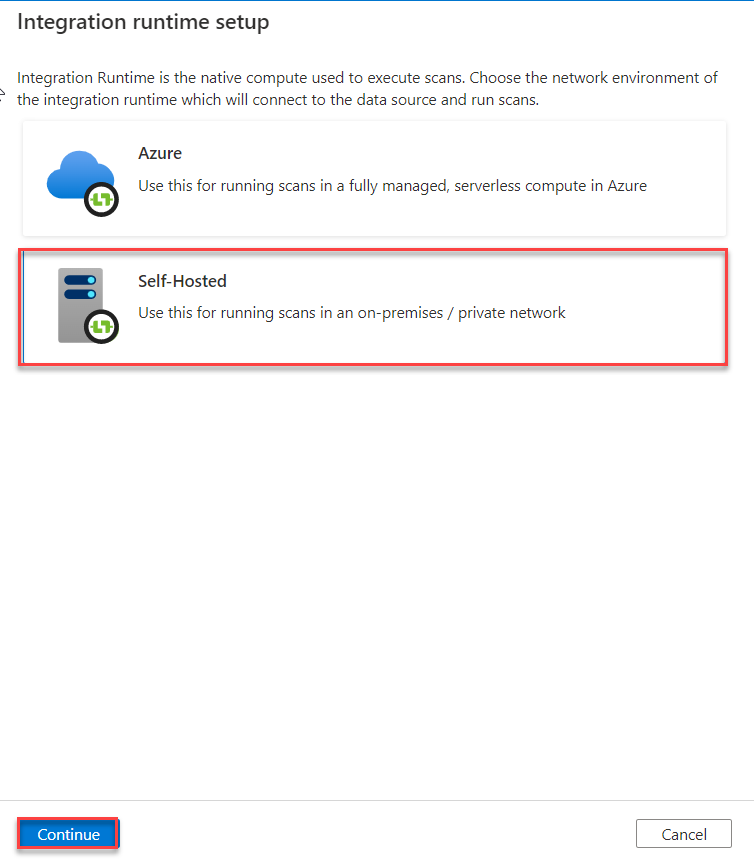

8. After completing the wizard, you see a link where you can download the latest version of the runtime. You also find two keys. Copy the first one to your clipboard.

   > **Note**: The runtime has to be installed on the VM you are connected through RDP (i.e,- *pur-M11-VM*).
   
    
   
 
9. Open the download link in the Remote VM, and select download.

      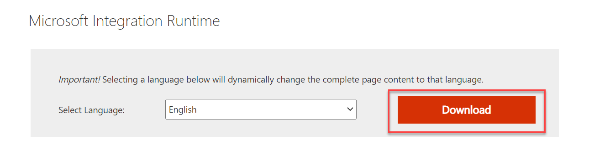
   
10. On **Choose the download you want** select the latest runtime and select **Next**.
    
      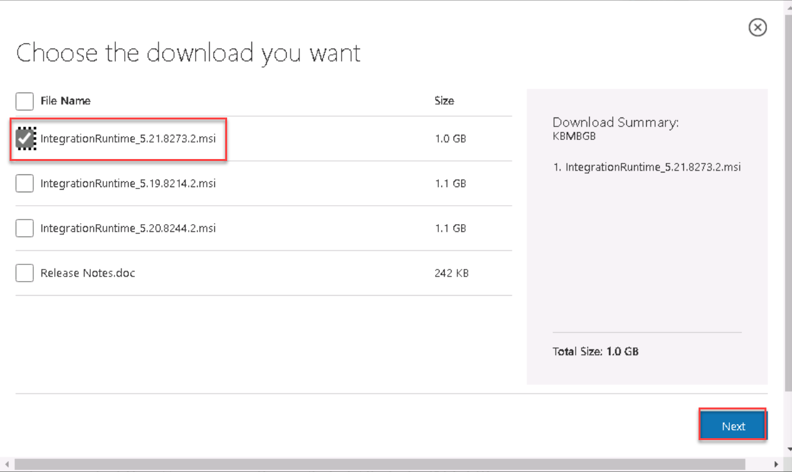
   

11. Once the runtime is downloaded open runtime, on **Microsoft Integration Runtime setup** click **Next**.

   
      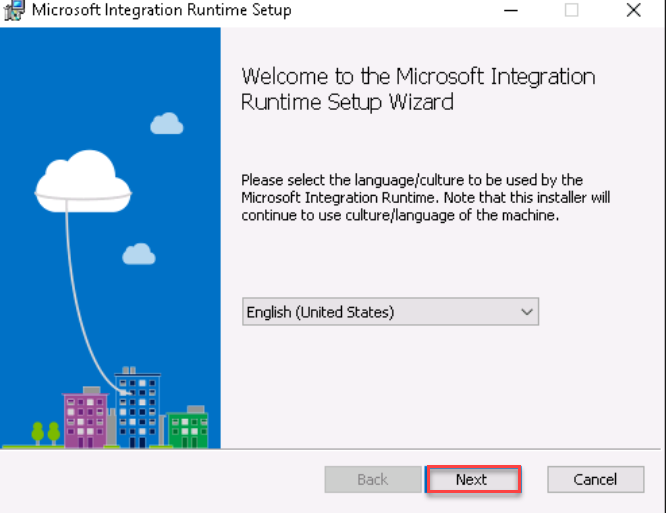


12. On the **End-User License** accept the terms and click **Next**.

      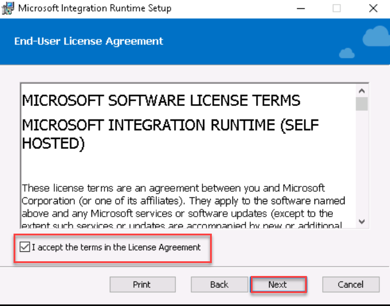

13. Leave the **Destination Floder** default and click **Next**.

      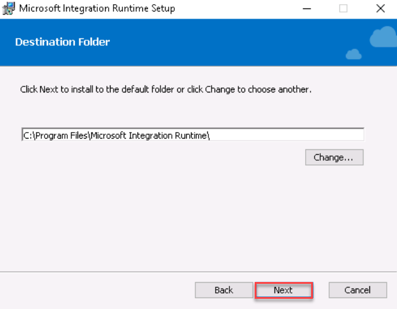

14. Click **Install** on **Ready to install Microsoft Integration Runtime**.

      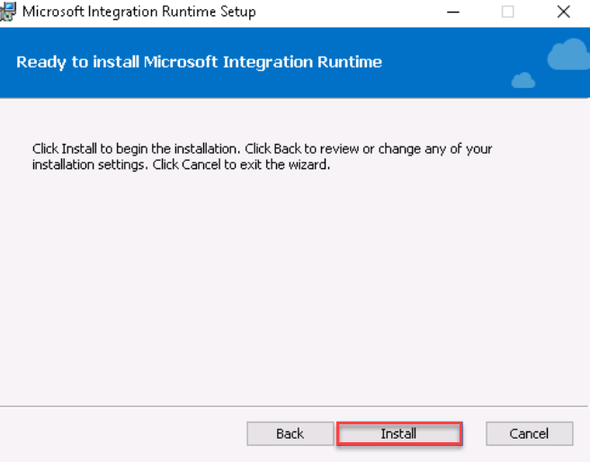

15. Click **Finish** to complete the installation.

      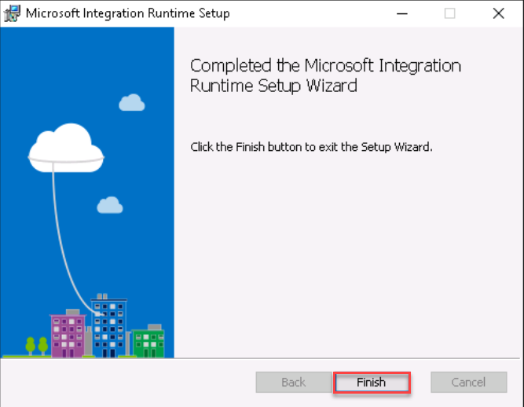
      
 16. After the **Runtime** is installed, on the **Register Integration Runtime (Self-hosted)** enter the key copied in Step-8 and select **Register** and select **Finsh** once registerd .
 
      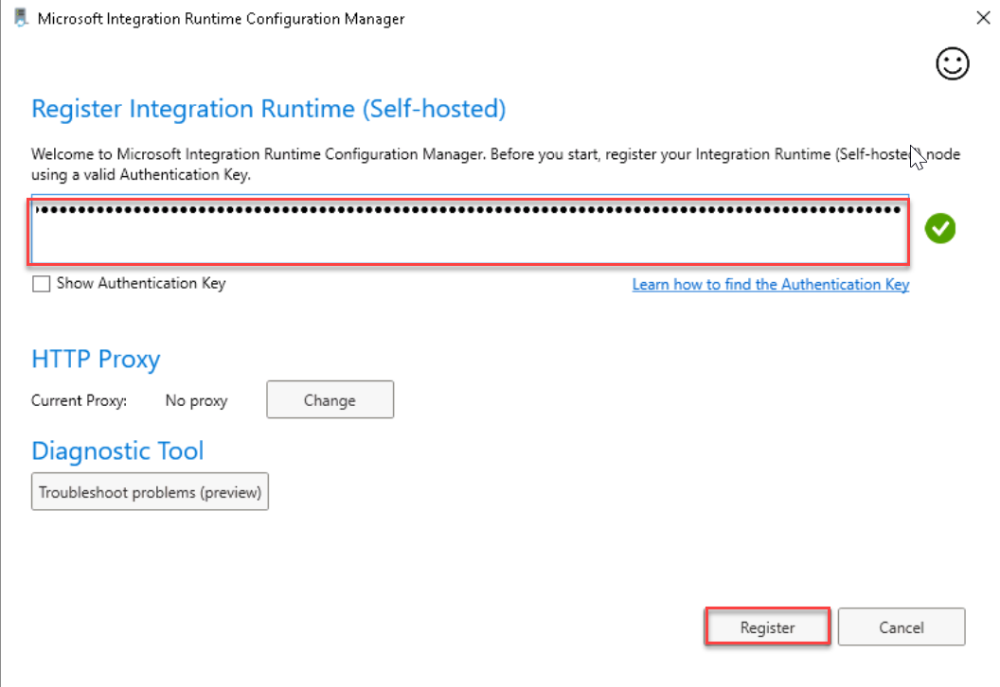
  
  17. If everything works well your self-hosted integration runtime should be running within Purview. Congrats that you made it this far!

      
      
<div align="right"><a href="#module-11---securely-scan-sources-using-self-hosted-integration-runtimes">↥ back to top</a></div>

## 5. Key vault creation

For securely accessing your storage account you will store your storage account key in a Key Vault. A key vault is a central place for managing your keys, secrets, credentials and certifications. This avoids keys get lost or changing these is a cumbersome task.

1. For creating a Key Vault go back to your Azure Portal. Search for Key Vault, hit create, provide the details mentioned below and select **Review+Create**.

|Settings|Value|
|---|---|
|Resource Group|purviewlab-rg|
|Key vault name|Keyvault-DID|

  > **Note**: Replace **DID** value it is available in the **Environment Details**
   
   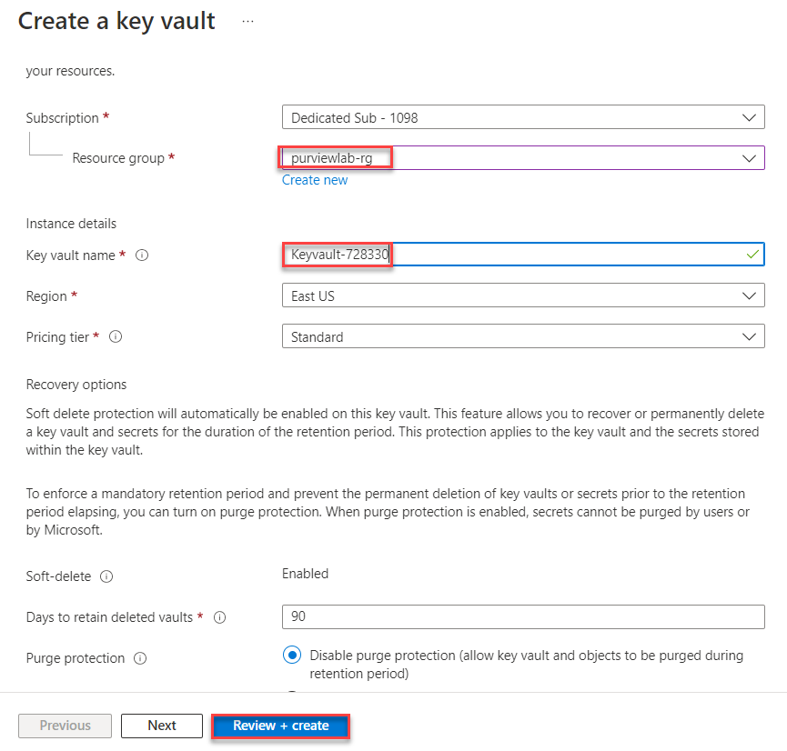

2. After deployment you need to ensure that Microsoft Purview has read access to the Key Vault. Open Key Vault, go to **Access configuration**, and hit **Go to access policies**.

   

3. Inside **Access Policies** select the **ODL_User_DID** and select **+Create**.
   
   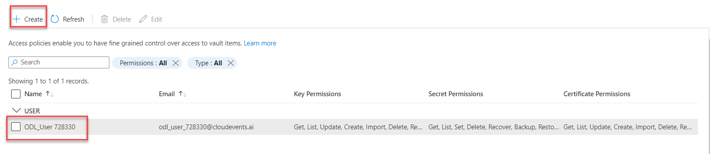

4. Because the Account Key is just a secret we will only provide access for Get and List. Click **Next**.

   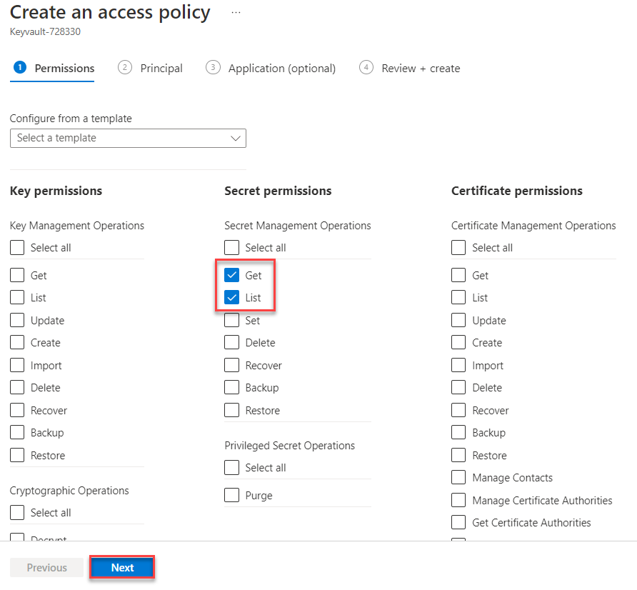

5. For providing access you need to use the system-managed identity of Microsoft Purview. This identity has the same name as your Purview instance name. Find **pvlab-DID-pv**, select it and hit **Next**.

   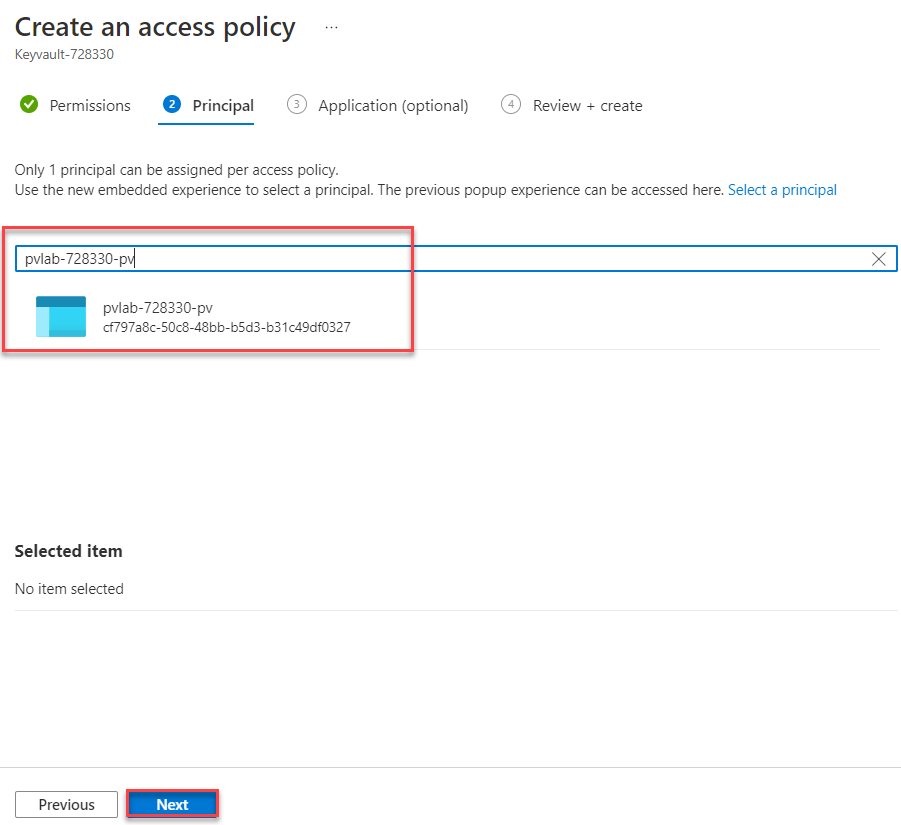
   
 6. Leave the **Application** pane default and on **Review+Create** click **Create**.
 
   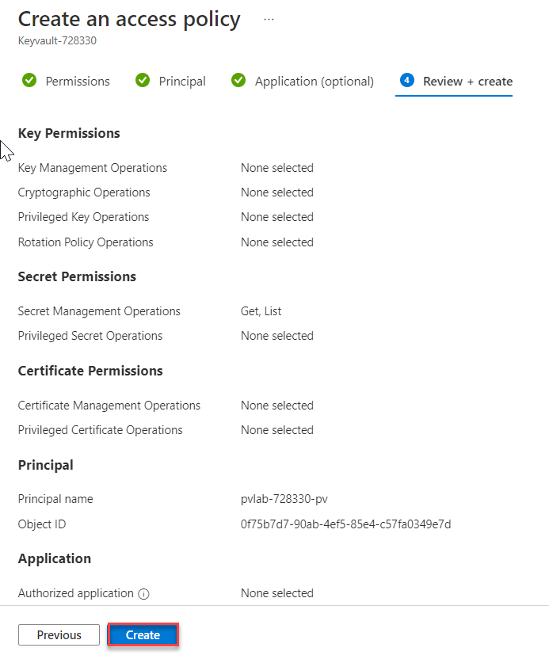
 
7. Next you need to ensure two things: 1) purview’s managed identity has access to read from the storage account 2) the storage account key has been stored in the Key Vault. Go back to your storage account. Navigate to **Access Control (IAM)** and select **Add** in the drop down select **Add role assignment**.

   

8. In the **Add role Assignment** pane under **Role** add **Storage Blob Data Reader** and select **Next**

   

9. Under **Members** choose **Managed identity**(1) for **Assign access to**, click on **+Select members**(2), in the **Select managed identities** pane from the drop down for **Managed identities** select **Microsoft Purview account**(3), under **Select** choose **pvlab-728330-pv**(4) and **Select**(5).

 
 
 10. Leave the rest default and select **Review+assign**.
 
 

11. Next, go to **Access keys** within the storage account section. Show the keys using the button at the top. Select Key1 and copy the secret to your clipboard. Head back to your Key Vault.

   

12. Within your Key Vault, select **Secrets** and choose **+ Generate/Import**. 

 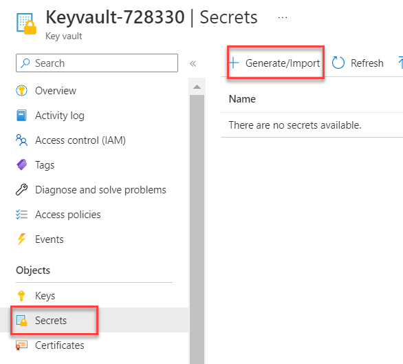

13.The dialog below should pop up. Enter name **"key-purview-secret"** for your secret and copy/paste the Storage Account Key value from your clipboard. Hit Create to store your newly created secret.

   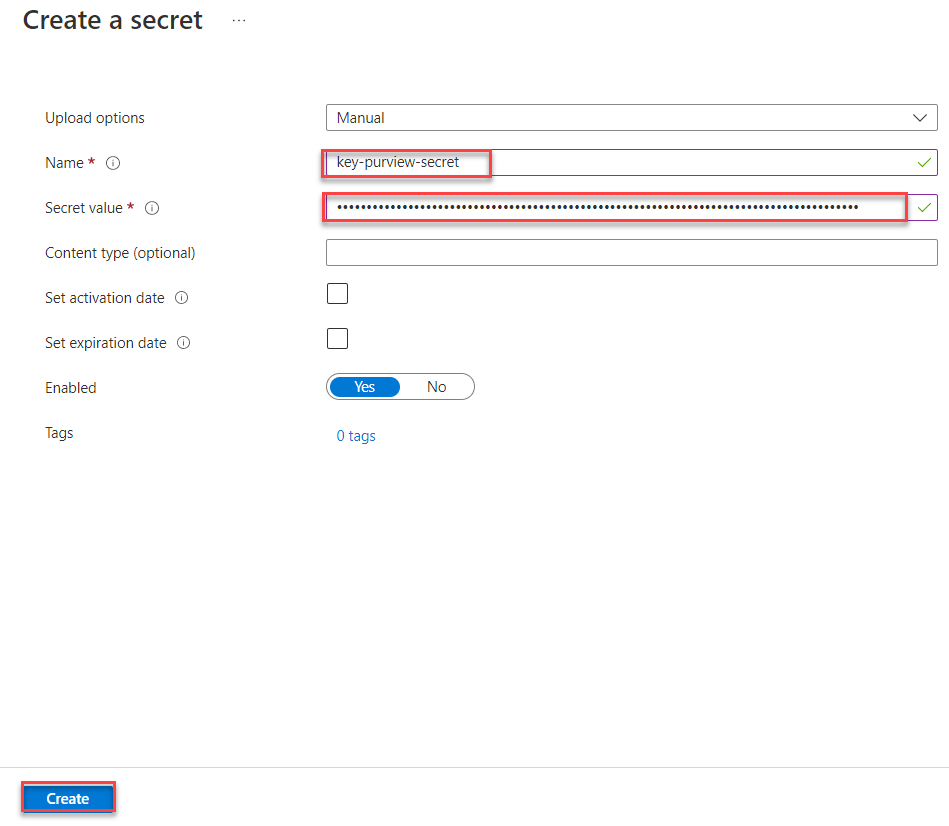

<div align="right"><a href="#module-11---securely-scan-sources-using-self-hosted-integration-runtimes">↥ back to top</a></div>

## 6. Key Vault configuration within Microsoft Purview

Now the Storage Account Key has been stored in the Key Vault it is time to move back to Microsoft Purview for your final configuration. Go to your settings panel on the right and select Credentials.

1. Navigate back to the Azure purview tab on the browser, go to **Management**(1) select **Credentials**(2) and click **+New**(3). On the **New credential** tab provide the following details and click **Create**:  

|Settings|Value|
|---|---|
|Name|key-purview-secret|
|Authentication method|Account key|
|Key vault connection| myKeyVault|
|Secret name|key-purview-secret|

 > **Note**: It is important that this name exactly matches the name of your secret in the Key Vault!
   
  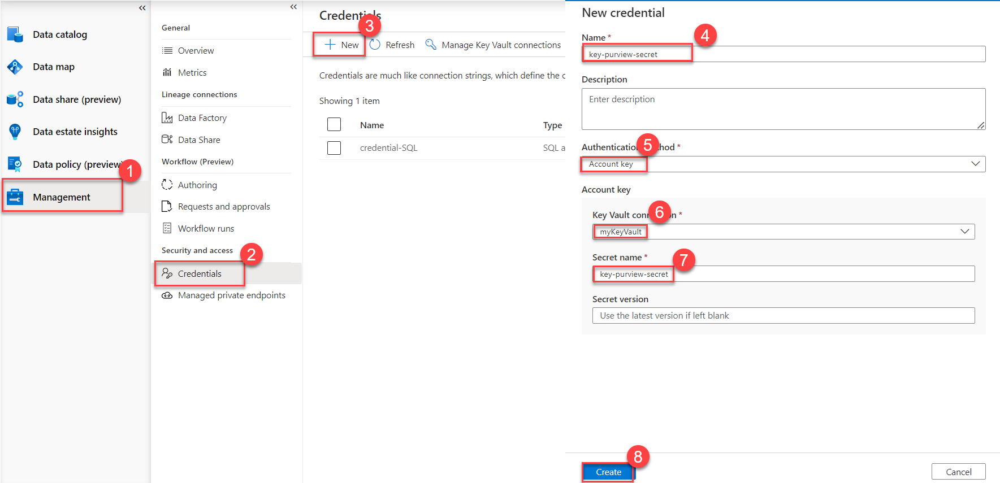

2. Now you can move to **Data map**(1)>**Sources**(2) and select **Register**(3) in the **Register source** pane , search and select **Azure Data Lake Storage Gen2**(4) and **Continue**(5) select your storage account from the list.


     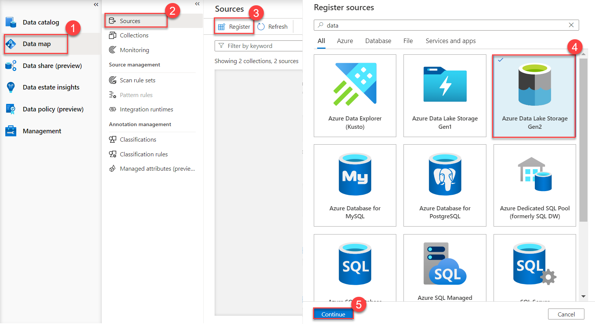

3. In the **Register sources** select your storage account and register.
     
     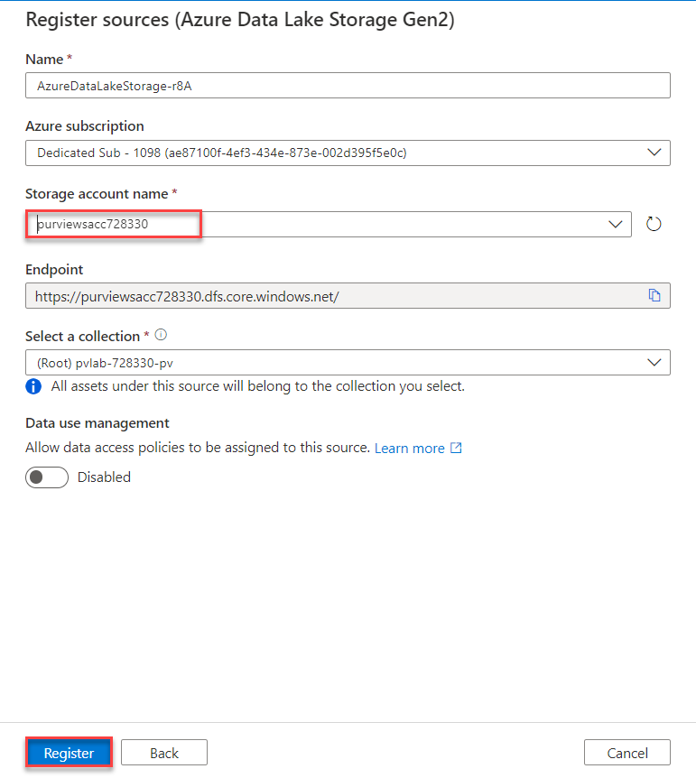

4. Next you need to start scanning your source. Click new scan 

    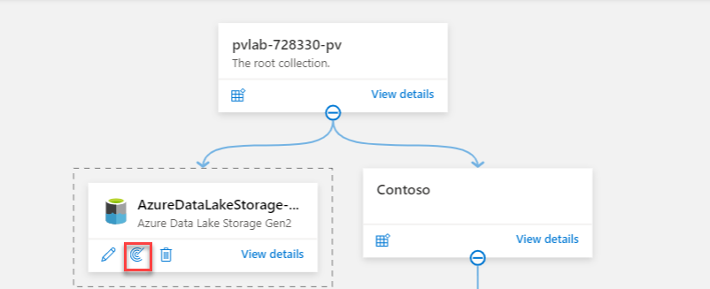


5. Select your Self-Hosted Integration Runtime from the list. Before you continue ensure everything works by testing your connection.

   

5. If everything works you should be able to select your folders and start scanning!

     

<div align="right"><a href="#module-11---securely-scan-sources-using-self-hosted-integration-runtimes">↥ back to top</a></div>

## 7. Summary

This has been a long read, but also demonstrates how you can use your own integration runtime to securely scan sources. With some additional overhead all data and metadata traffic remains secure within your own virtual network. There’s no risk for any data exfiltration!

<div align="right"><a href="#module-11---securely-scan-sources-using-self-hosted-integration-runtimes">↥ back to top</a></div>

> :bulb: **Did you know?**
>
> The Purview Integration Runtime can also be used to scan and ingest metadata assets from Azure cloud services that are hidden behind private endpoints, such as Azure Data Lake, Azure SQL Database, Azure Cosmos DB [and more](https://docs.microsoft.com/azure/purview/catalog-private-link#support-matrix-for-scanning-data-sources-through-ingestion-private-endpoint).

<div align="right"><a href="#module-11---securely-scan-sources-using-self-hosted-integration-runtimes">↥ back to top</a></div>

## :mortar_board: Knowledge Check

[https://aka.ms/purviewlab/q11](https://aka.ms/purviewlab/q11)

1. What is an Self-Hosted Integration Runtime used for?

   A) It's used for copying data from or to an on-premises data store or networks with access control  
   B) It's used for copying data between cloud based data stores or networks with public endpoints  
   C) It's used for copying data between managed environments

2. Self-Hosted Integration Runtime can be shared across multiple services when installed on one machine/VM.

   A) True  
   B) False

3. Which Azure services can be scanned and have metadata assets ingested from using the self-hosted integration runtime?

   A) Azure Blob Storage  
   B) Azure SQL Database  
   C) Azure Synapse Analytics  
   D) All of these  
   E) None of these

<div align="right"><a href="#module-11---securely-scan-sources-using-self-hosted-integration-runtimes">↥ back to top</a></div>

## :tada: Summary

In this module, you learned how to install the self-hosted integration runtime to your virtual machine network and get it connected up to Microsoft Purview. If you'd like continue with this module to complete further tasks, please feel free to complete the tutorial links below:

- [Setting up authentication for a scan](https://docs.microsoft.com/azure/purview/register-scan-on-premises-sql-server#setting-up-authentication-for-a-scan)
- [Register SQL Server on VM as a data source in Purview](https://docs.microsoft.com/azure/purview/register-scan-on-premises-sql-server#register-a-sql-server-data-source)
- Upload same data to the SQL Server on the VM
  - [World Wide Importers dataset](https://github.com/Microsoft/sql-server-samples/tree/master/samples/databases/wide-world-importers)
  - [Contoso BI dataset](https://www.microsoft.com/download/details.aspx?id=18279)
- [Trigger a scan of the on-premise data source](https://docs.microsoft.com/azure/purview/register-scan-on-premises-sql-server#creating-and-running-a-scan)

[Continue >](../modules/module12.md)
