# Module 12 - Managed private endpoints

[< Previous Module](../modules/module11.md) - **[Home](../README.md)** - [Next Module >](../modules/module13.md)

## :loudspeaker: Introduction

An integration runtime (IR) is compute infrastructure that Microsoft Purview uses to power data scan across different network environments. These integration runtimes come in different flavors. One of them is using managed private endpoints, which Microsoft recently added. With this new set of features you can better manage and secure your data scanning within Purview. As a result your metadata traffic is distributed via Azure Private Link, which eliminated any exposure to the internet. This protects you from any data exfiltration risks.

In this lab you'll learn how to make use a managed private endpoints. You'll learn how to configure them.

## :thinking: Prerequisites

- An [Azure account](https://azure.microsoft.com/free/) with an active subscription.
- A SQL Virtual Machine (see [module 00](../modules/module00.md)).
- A Microsoft Purview account (see [module 01](../modules/module01.md)).

## :dart: Objectives

- Connect to on premise data source using a self-hosted integration runtime.

## :bookmark_tabs: Table of Contents

1. [Storage account creation](#1-storage-account-creation)
2. [Authentication for a scan](#2-authenticate-for-a-scan)
3. [Managed Virtual Network Integration Runtime](#3-managed-virtual-network-integration-runtime)
4. [Private endpoint for Azure Blob Storage](#4-private-endpoint-for-azure-blob-storage)
5. [Configure source and scanning](#5-configure-source-and-scanning)

<a href="#module-12---managed-private-endpoints">↥ back to top</a>

## 1. Storage account creation

1.  On the Azure Portal home page select create new resource. Select the resource group you just created, provide a unique name, and hit next.
 
     > **Note**: We will setup a storage account for demonstration. This is the resource that will be scanned during this demo.
   
      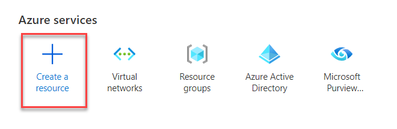

2. Search Storage Account and select **Create**.

      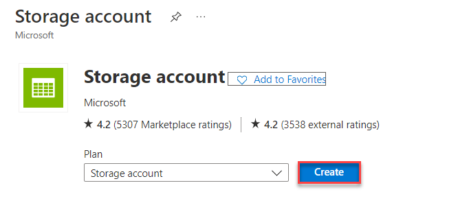
      
3. On the **Create Storage Account** tab, select your subcription, and from the dropdown for **Resource Group** select **purviewlab-rg**. 
   
      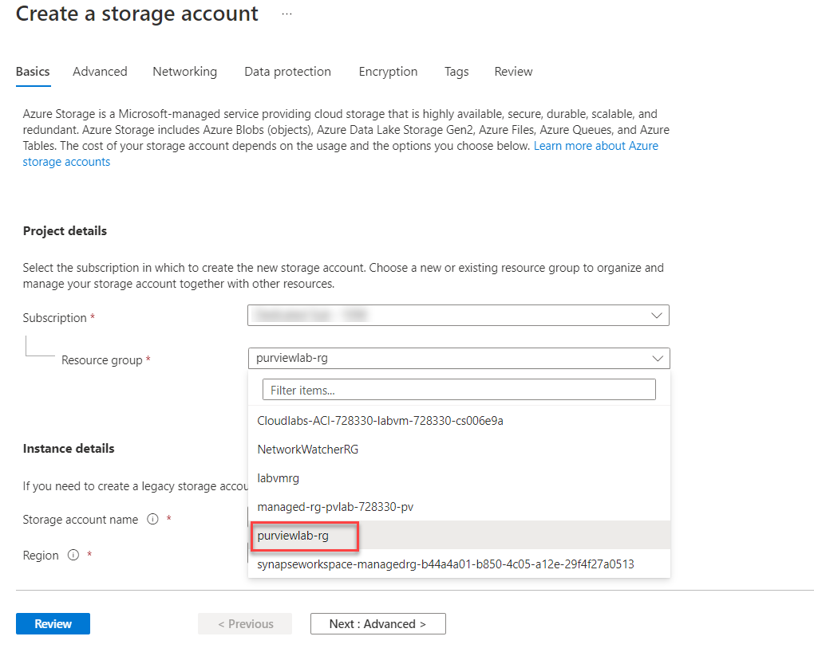
  
4. Provide a unique name for your storage account and click **Next: Advanced>**.
  
      
   
5. In the **Advanced** section of **Create Storage Account** ensure that **hierarchical namespaces** are selected. Click next to jump over to the **Networking tab**.

         

6. In the **Networking** tab, select **Disable public access and use private access** as the **Network Access**. Don’t create any private endpoints at this stage. This comes later. Then hit **Review** and **Review+Create** to create the storage account.

    

7. Click **Create** to create the storage account.
    
    

## 2. Authentication for a scan

1.  Next you need to ensure two things: 1) purview’s managed identity has access to read from the storage account 2) the storage account key has been stored in the Key Vault. Go back to your storage account. Navigate to **Access Control (IAM)** and select **Add** in the drop down select **Add role assignment**.

   
   
2. In the **Add role Assignment** pane under **Role** add **Storage Blob Data Reader** and select **Next**

   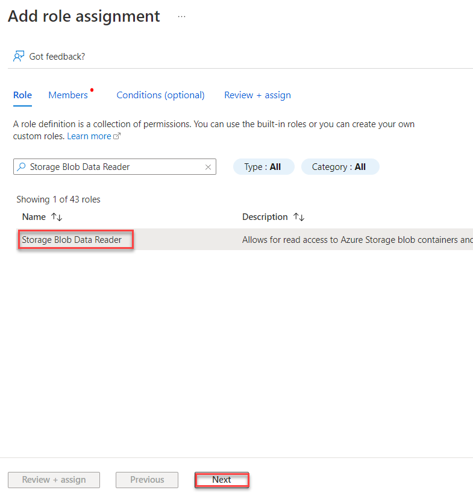
   
3. Under **Members** choose **Managed identity**(1) for **Assign access to**, click on **+Select members**(2), in the **Select managed identities** pane from the drop down for **Managed identities** select **Microsoft Purview account**(3), under **Select** choose **pvlab-{DID}-pv**(4) and **Select**(5).

    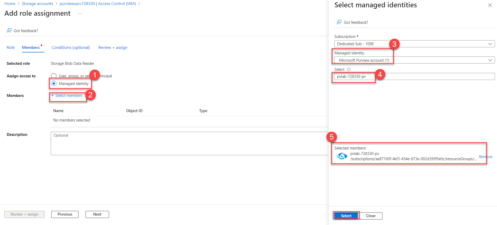
 
4. Leave the rest default and select **Review+assign**.
 
    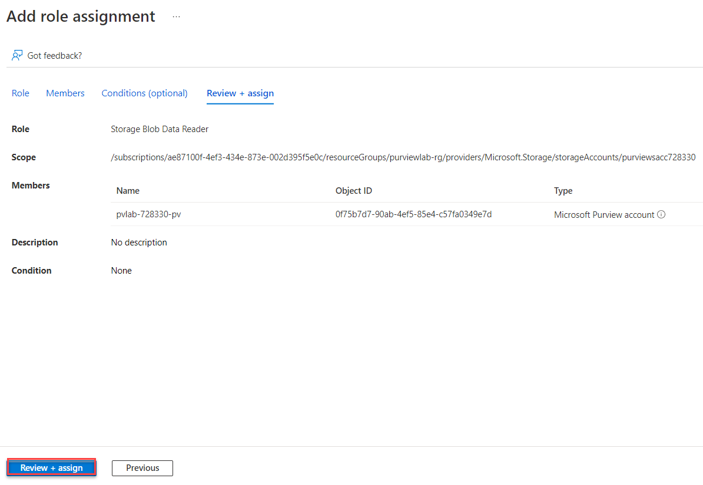

At this stage we’re all set and can continue by opening Microsoft Purview.

## 3. Managed Virtual Network Integration Runtime

With the newly released features Microsoft Purview now provides three options for scanning sources:

- **Microsoft Purview default’s integration runtime**: this option is useful when connecting to data stores and computes services with public accessible endpoints.
- **Self-hosted integration runtimes (SHIR)**: this option particularly useful for VM-based data sources or applications that either sit in a private network (VNET) or other networks, such as on-premises.
- **Managed Virtual Network Integration Runtime**: this new option supports connecting to data stores using private link service in private network environment. This ensures that data scanning process is completely isolated and secure, while also being fully managed.

1. Go to Microsoft Purview, select on **Data Map(1)** from left menu, select on **Integration runtime(2)**, click on **+ New(3)**, under **Integration runtime setup** select **Azure(4)**  and click on **Continue(5)**.

   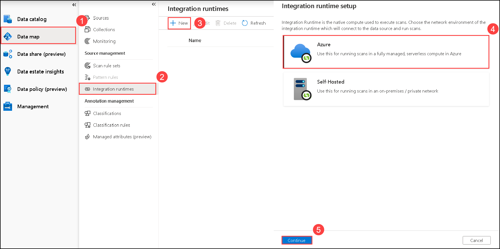

2. Give your new integration runtime a new, description and ensure that **Interactive authoring** is **Enable** and click on **Create**.

   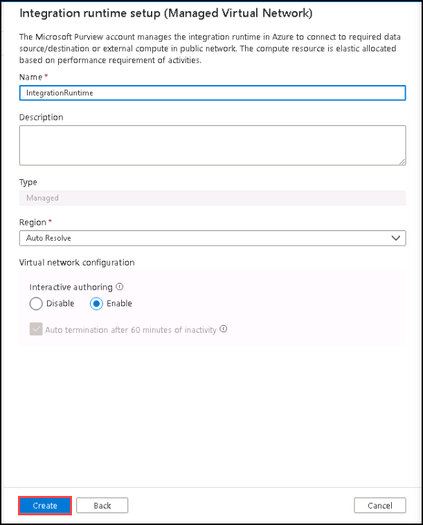

3. After deployment you must wait for the approval notifications. When ready, click on the **blue links** and navigate to the newly created resources.

   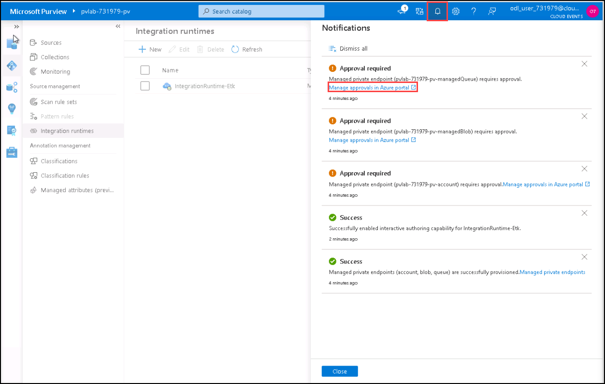
   
4. For the newly created resources you must approve the **Private Endpoint connections**. Click on each of them and change the status to **Approve**.

   
   
   >**Note**: make sure to select all the approval links and approve it 
      
      * When Approve connection pop-up appears click on **Yes**
      
         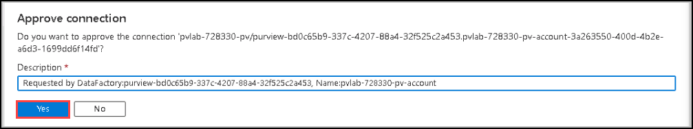
                           
5. Next, hover back to **Microsoft Purview**, click on **Management** from left menu and click on **Managed private endpoints**.

   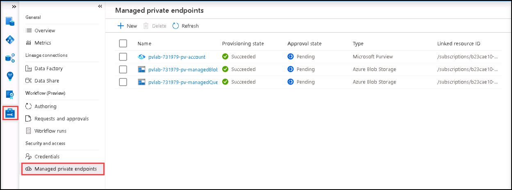

## 4. Private endpoint for Azure Blob Storage

1. The next step is creating a private endpoint for the newly created storage account. When you are still in the **Managed private endpoints** section, click on **+ new**. Select **Azure Data Lake Storage Gen2** and click **Continue**.

   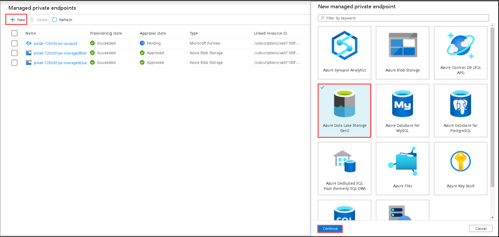

2. In **New managed private endpoint (Azure Data Lake Storage Gen2)** blade select your **Azure subscription**, the select your **Storage account name** which was created previously and click **Create**.

   

3. The same approval process kicks in. Go back to Azure portal, navigate to your **storage account**, go to **networking** under Security + networking, click on **private endpoint connections**, and you will see a newly requested item is created. Repeat the same steps by approving the endpoint.

   

4. Go back to **Microsoft Purview** and wait for all managed private endpoints to be approved.

   
   
   >**Note**: To see the **Approved** status, please **refresh** the page  

## 5. Configure source and scanning

1. Now you can move to **Data map**(1)>**Sources**(2) and select **Register**(3) in the **Register source** pane , search and select **Azure Data Lake Storage Gen2**(4) and **Continue**(5) select your storage account from the list.
   
      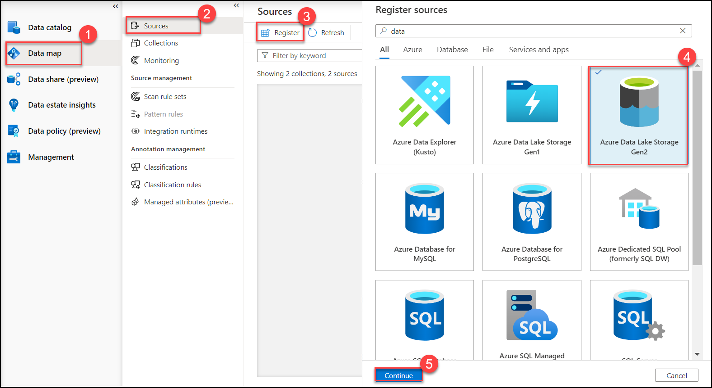

2. Next, register your source. Select your **Storage account** previously created, you will see the public endpoint listed here, but this configuration will be overwritten once we start scanning. Hit **Register** and finish.

      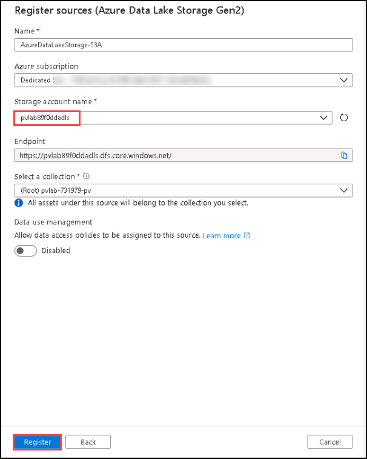

3. Next you need to start scanning your source. Click **New scan**

      

4. Next you configure scanning for your newly created source. It’s important to select the **IntegrationRuntime (Managed Virtual Network)** from the list. Add your source to a collection, and hit **continue**.

      

5. Finally, you must test your connection and hit **continue**.  

      
   
6. In select a **scan rule set** blade, select **AdlsGen2** and click on **Continue**.

      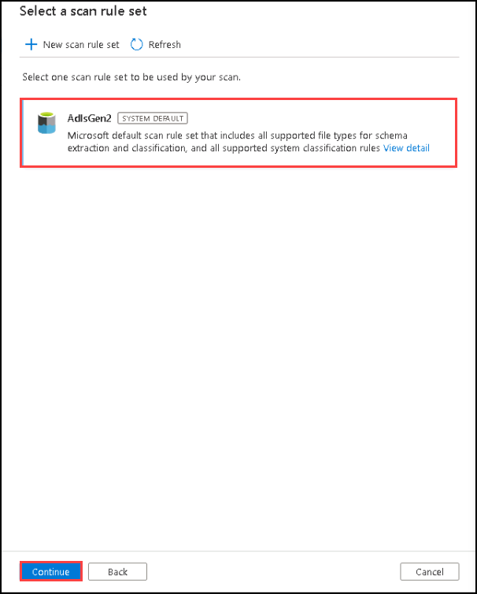
   
7.  In **Set a scan trigger** blade set, set it to **once** and click on **Continue**.

      
   
8. In **Review your scan** blade review it and click on **save and run** to complete the scanning. 

      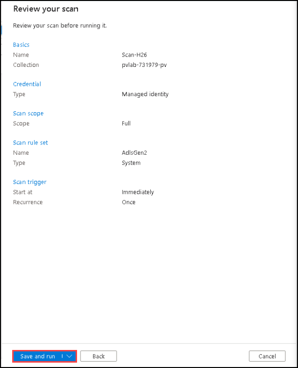
   
If everything goes well you’ll notice new metadata will be added to Purview. This all will be very secure, because all metadata is transferred using private endpoints.

> :bulb: **Did you know?**
>
> By using managed private endpoints, you do not have to manage your own VNETs. Microsoft takes care of managing this. [More information](https://docs.microsoft.com/azure/purview/catalog-managed-vnet).

<a href="#module-12---managed-private-endpoints">↥ back to top</a>

## :mortar_board: Knowledge Check

1. By using managed private endpoints you're protected from any data exfiltration risks.

   A) True  
   B) False

<a href="#module-12---managed-private-endpoints">↥ back to top</a>

## :tada: Summary

In this module, you learned how to install managed private endpoints. If you'd like continue with this module to complete further tasks, please feel free to complete the tutorial links below:

- [Use a Managed VNet with your Microsoft Purview account](https://docs.microsoft.com/azure/purview/catalog-managed-vnetn)

[Continue >](../modules/module13.md)
